# CredVigil Training Guide — Module 4: File System Watcher

> **Version**: 0.1.0  
> **Component**: File System Watcher (Component 4 of 15)  
> **Audience**: Everyone — no programming or IT background required. Written for learners preparing for interviews.  
> **Prerequisites**: Completion of Modules 1–3. Go 1.21+ installed (for hands-on exercises only).

---

## Table of Contents

1. [What Is the File System Watcher?](#1-what-is-the-file-system-watcher)
2. [Why Do We Need Real-Time Monitoring?](#2-why-do-we-need-real-time-monitoring)
3. [Key Concepts Explained](#3-key-concepts-explained)
   - 3.1 [What Are File System Events?](#31-what-are-file-system-events)
   - 3.2 [What Is fsnotify?](#32-what-is-fsnotify)
   - 3.3 [What Is Event Debouncing?](#33-what-is-event-debouncing)
   - 3.4 [What Is Recursive Watching?](#34-what-is-recursive-watching)
   - 3.5 [What Is a Callback?](#35-what-is-a-callback)
   - 3.6 [What Is Context Cancellation?](#36-what-is-context-cancellation)
   - 3.7 [What Is Concurrency Safety?](#37-what-is-concurrency-safety)
   - 3.8 [What Are Exclusion Patterns?](#38-what-are-exclusion-patterns)
   - 3.9 [What Is an Event Loop?](#39-what-is-an-event-loop)
   - 3.10 [What Is Graceful Shutdown?](#310-what-is-graceful-shutdown)
4. [Architecture Overview](#4-architecture-overview)
5. [The Source Files](#5-the-source-files)
   - 5.1 [watcher.go — Types and Configuration](#51-watchergo--types-and-configuration)
   - 5.2 [watcher.go — Core Watcher Implementation](#52-watchergo--core-watcher-implementation)
   - 5.3 [watcher.go — Event Loop and Debounce](#53-watchergo--event-loop-and-debounce)
   - 5.4 [watcher.go — Path Management and Filtering](#54-watchergo--path-management-and-filtering)
6. [How It All Fits Together](#6-how-it-all-fits-together)
7. [The Watching Flow Step by Step](#7-the-watching-flow-step-by-step)
8. [Integration with the Detection Engine](#8-integration-with-the-detection-engine)
9. [Understanding Watcher Output](#9-understanding-watcher-output)
10. [Hands-On Exercises](#10-hands-on-exercises)
11. [Deep Dive: Code Walkthrough](#11-deep-dive-code-walkthrough)
    - 11.1 [Event Types and Models](#111-event-types-and-models)
    - 11.2 [Configuration and Defaults](#112-configuration-and-defaults)
    - 11.3 [Watcher Lifecycle](#113-watcher-lifecycle)
    - 11.4 [Event Loop Implementation](#114-event-loop-implementation)
    - 11.5 [Path Management](#115-path-management)
    - 11.6 [Filtering Logic](#116-filtering-logic)
12. [Platform-Specific Behavior](#12-platform-specific-behavior)
13. [Performance & Scalability](#13-performance--scalability)
14. [Error Handling & Resilience](#14-error-handling--resilience)
15. [Frequently Asked Questions](#15-frequently-asked-questions)
16. [Glossary](#16-glossary)
17. [Interview Tips — File System Watcher](#17-interview-tips--file-system-watcher)
18. [Marketing Tips — File System Watcher](#18-marketing-tips--file-system-watcher)
19. [What's Next?](#19-whats-next)

---

## 1. What Is the File System Watcher?

In Modules 1–3, you learned how CredVigil scans files on demand and digs through git history. But both of those are **reactive** — you run a scan, you get results. What if a developer saves a file with a secret *right now*? You wouldn't know until the next scan.

The File System Watcher adds **real-time monitoring** — it watches directories and files as they change, triggering secret detection the instant a file is saved.

### How This Component Connects to the Others

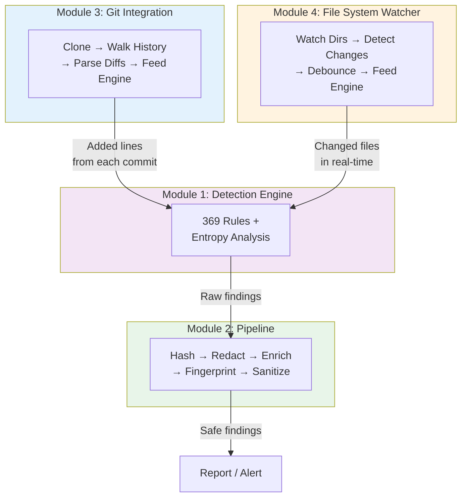
```mermaid
flowchart TB
    subgraph M1["Module 1: Detection Engine"]
        ENGINE["369 Rules +\nEntropy Analysis"]
    end
    subgraph M2["Module 2: Pipeline"]
        PIPE["Hash → Redact → Enrich\n→ Fingerprint → Sanitize"]
    end
    subgraph M3["Module 3: Git Integration"]
        GIT["Clone → Walk History\n→ Parse Diffs → Feed Engine"]
    end
    subgraph M4["Module 4: File System Watcher"]
        WATCH["Watch Dirs → Detect Changes\n→ Debounce → Feed Engine"]
    end
    
    GIT -->|"Added lines\nfrom each commit"| ENGINE
    WATCH -->|"Changed files\nin real-time"| ENGINE
    ENGINE -->|"Raw findings"| PIPE
    PIPE -->|"Safe findings"| OUTPUT["Report / Alert"]
    
    style M1 fill:#f3e5f5
    style M2 fill:#e8f5e9
    style M3 fill:#e3f2fd
    style M4 fill:#fff3e0
```

> **Interview Tip**: If asked "How do the four components connect?", say: "Component 4 detects file changes in real-time and feeds changed file paths to Component 1's detection engine. The results go through Component 2's zero-trust pipeline. This complements Component 3's git history scanning — together, they cover both past and present exposures."

### Real-World Analogy: The Security Guard vs. The Security Camera

Modules 1–3 are like reviewing security camera **footage** — you look through what already happened. Module 4 is the **live feed** — a guard watching monitors in real-time, reacting the moment something suspicious appears.

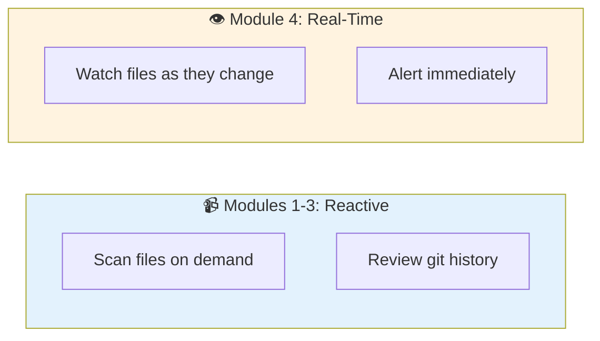
```mermaid
flowchart LR
    subgraph REACTIVE["📹 Modules 1-3: Reactive"]
        A["Scan files on demand"]
        B["Review git history"]
    end
    subgraph REALTIME["👁️ Module 4: Real-Time"]
        C["Watch files as they change"]
        D["Alert immediately"]
    end
    
    style REACTIVE fill:#e3f2fd
    style REALTIME fill:#fff3e0
```

> **Key Insight**: Reactive scanning tells you "there was a problem." Real-time monitoring tells you "there IS a problem, right NOW." You need both for complete coverage.

### What CredVigil's Watcher Does (Bird's-Eye View)

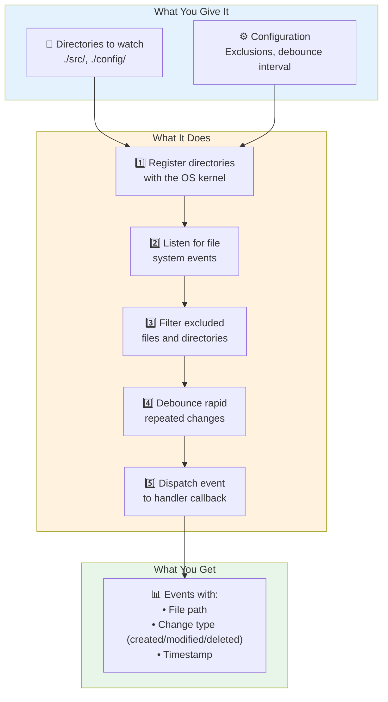
```mermaid
flowchart TB
    subgraph INPUTS["What You Give It"]
        DIRS["📁 Directories to watch\n./src/, ./config/"]
        OPTS["⚙️ Configuration\nExclusions, debounce interval"]
    end
    
    subgraph PROCESS["What It Does"]
        REGISTER["1️⃣ Register directories\nwith the OS kernel"]
        LISTEN["2️⃣ Listen for file\nsystem events"]
        FILTER["3️⃣ Filter excluded\nfiles and directories"]
        DEBOUNCE["4️⃣ Debounce rapid\nrepeated changes"]
        DISPATCH["5️⃣ Dispatch event\nto handler callback"]
    end
    
    subgraph OUTPUTS["What You Get"]
        EVENTS["📊 Events with:\n• File path\n• Change type (created/modified/deleted)\n• Timestamp"]
    end
    
    DIRS --> REGISTER
    OPTS --> REGISTER
    REGISTER --> LISTEN --> FILTER --> DEBOUNCE --> DISPATCH --> EVENTS
    
    style INPUTS fill:#e3f2fd
    style PROCESS fill:#fff3e0
    style OUTPUTS fill:#e8f5e9
```

---

## 2. Why Do We Need Real-Time Monitoring?

### The Problem

Consider this timeline:

1. **10:00 AM** — Developer saves `config.env` with an AWS key
2. **10:01 AM** — Developer pushes to GitHub
3. **10:30 AM** — Daily CredVigil scan runs and finds the key
4. **10:30 AM** — Alert sent to security team
5. **10:45 AM** — Security team rotates the key

**30 minutes of exposure.** During that time, anyone who cloned the repo had access to the key.

Now with real-time monitoring:

1. **10:00 AM** — Developer saves `config.env` with an AWS key
2. **10:00 AM** — CredVigil watcher detects the file change **instantly**
3. **10:00 AM** — Alert sent to developer's IDE / terminal
4. **10:01 AM** — Developer removes the key before pushing

**Zero exposure.** The secret never reached the repository.

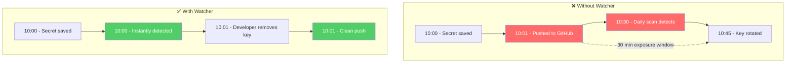
```mermaid
flowchart TB
    subgraph WITHOUT["❌ Without Watcher"]
        W1["10:00 - Secret saved"] --> W2["10:01 - Pushed to GitHub"]
        W2 --> W3["10:30 - Daily scan detects"]
        W3 --> W4["10:45 - Key rotated"]
        W2 -.->|"30 min exposure window"| W4
    end
    
    subgraph WITH["✅ With Watcher"]
        R1["10:00 - Secret saved"] --> R2["10:00 - Instantly detected"]
        R2 --> R3["10:01 - Developer removes key"]
        R3 --> R4["10:01 - Clean push"]
    end
    
    style W2 fill:#ff6b6b,color:white
    style W3 fill:#ff6b6b,color:white
    style R2 fill:#51cf66,color:white
    style R4 fill:#51cf66,color:white
```

> **Interview Tip**: "The watcher reduces the exposure window from hours (batch scanning) to milliseconds (real-time). In security, time-to-detection directly correlates with breach severity. Earlier detection = smaller blast radius."

### The Detection Spectrum

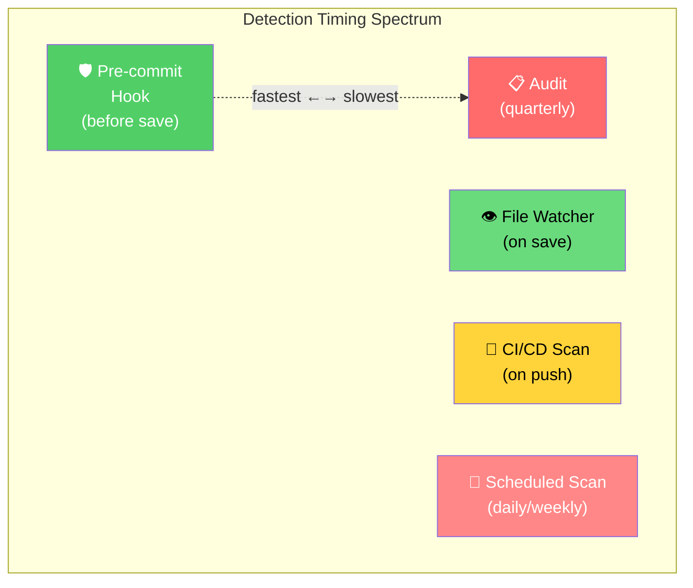
```mermaid
flowchart LR
    subgraph SPECTRUM["Detection Timing Spectrum"]
        direction LR
        PRE["🛡️ Pre-commit\nHook\n(before save)"]
        WATCH["👁️ File Watcher\n(on save)"]
        PUSH["🚀 CI/CD Scan\n(on push)"]
        SCHED["📅 Scheduled Scan\n(daily/weekly)"]
        AUDIT["📋 Audit\n(quarterly)"]
    end
    
    PRE -.->|"fastest ←→ slowest"| AUDIT
    
    style PRE fill:#51cf66,color:white
    style WATCH fill:#69db7c,color:black
    style PUSH fill:#ffd43b,color:black
    style SCHED fill:#ff8787,color:white
    style AUDIT fill:#ff6b6b,color:white
```

The watcher sits at the second-fastest position — detecting secrets the instant a file is saved, before it's even committed or pushed.

### Why Not Just Use Pre-Commit Hooks?

| Feature | Pre-Commit Hook | File System Watcher |
|---------|:--------------:|:-------------------:|
| Catches secrets before commit | ✅ | ✅ (even earlier — on save) |
| Works outside git repos | ❌ | ✅ |
| Catches secrets in config files not tracked by git | ❌ | ✅ |
| Can be bypassed with `--no-verify` | ✅ (risky) | ❌ (always on) |
| Runs continuously in background | ❌ | ✅ |
| Requires git | ✅ | ❌ |

> **Key Principle**: Pre-commit hooks are opt-in and bypassable. The file watcher is always-on and independent of git. Use both for defense in depth.

---

## 3. Key Concepts Explained

### 3.1 What Are File System Events?

Every time a file or directory changes on your computer, the operating system generates an **event** — a notification saying "something happened."

**Everyday Analogy**: Your phone sends you a notification when you get a text message. The operating system sends your program a notification when a file is created, modified, or deleted.

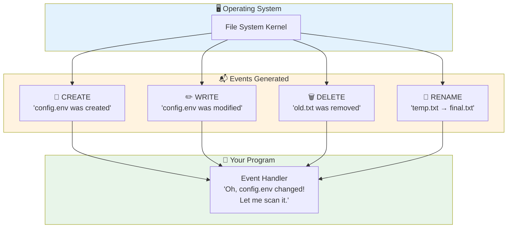
```mermaid
flowchart TB
    subgraph OS["🖥️ Operating System"]
        KERNEL["File System Kernel"]
    end
    
    subgraph EVENTS["📬 Events Generated"]
        CREATE["📄 CREATE\n'config.env was created'"]
        WRITE["✏️ WRITE\n'config.env was modified'"]
        DELETE["🗑️ DELETE\n'old.txt was removed'"]
        RENAME["📝 RENAME\n'temp.txt → final.txt'"]
    end
    
    subgraph APP["📱 Your Program"]
        HANDLER["Event Handler\n'Oh, config.env changed!\nLet me scan it.'"]
    end
    
    KERNEL --> CREATE & WRITE & DELETE & RENAME
    CREATE & WRITE & DELETE & RENAME --> HANDLER
    
    style OS fill:#e3f2fd
    style EVENTS fill:#fff3e0
    style APP fill:#e8f5e9
```

#### The Four Event Types in CredVigil

| Event Type | What Happened | CredVigil Action |
|-----------|---------------|------------------|
| **CREATED** | A new file was created | Scan it for secrets |
| **MODIFIED** | An existing file was changed | Re-scan it for secrets |
| **DELETED** | A file was removed | Log the deletion (no scan needed) |
| **RENAMED** | A file was renamed | Scan the new name |

> **Interview Tip**: "File system events are generated by the OS kernel, not by polling. This means zero CPU usage while waiting — the kernel notifies us only when something actually changes. This is fundamentally different from a cron job that scans files every N seconds."

### 3.2 What Is fsnotify?

**fsnotify** is an open-source Go library that provides a cross-platform API for file system notifications. It wraps the OS-specific mechanisms:

| Operating System | Native API | What It Does |
|-----------------|-----------|--------------|
| **Linux** | inotify | Kernel-level file monitoring (most efficient) |
| **macOS** | kqueue / FSEvents | BSD-style event notification / Apple's high-level API |
| **Windows** | ReadDirectoryChangesW | Win32 API for directory change notifications |

**Everyday Analogy**: fsnotify is like a universal TV remote that works with any brand of TV. Instead of learning three different remote controls (inotify, kqueue, ReadDirectoryChanges), you use one simple interface that works everywhere.

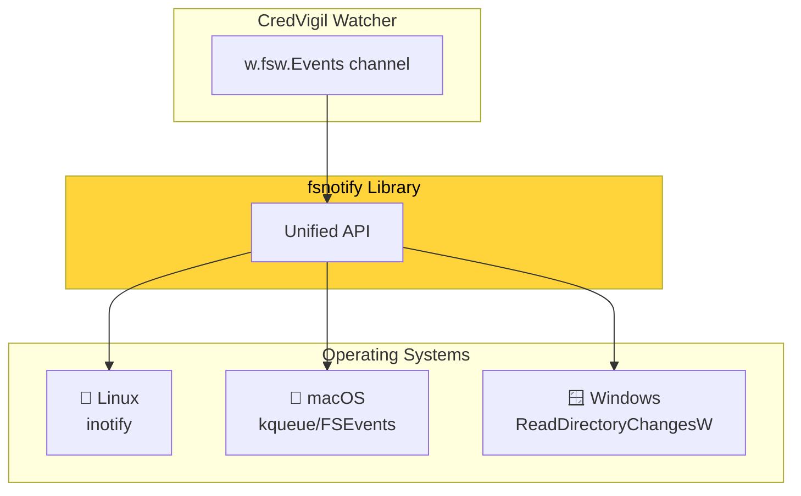
```mermaid
flowchart TB
    subgraph APP["CredVigil Watcher"]
        CODE["w.fsw.Events channel"]
    end
    
    subgraph FSNOTIFY["fsnotify Library"]
        ABSTRACT["Unified API"]
    end
    
    subgraph OS["Operating Systems"]
        LINUX["🐧 Linux\ninotify"]
        MAC["🍎 macOS\nkqueue/FSEvents"]
        WIN["🪟 Windows\nReadDirectoryChangesW"]
    end
    
    CODE --> ABSTRACT
    ABSTRACT --> LINUX
    ABSTRACT --> MAC
    ABSTRACT --> WIN
    
    style FSNOTIFY fill:#ffd43b,color:black
```

> **Interview Tip**: "We use fsnotify instead of directly calling inotify/kqueue because it gives us cross-platform support with a single API. The trade-off is adding one external dependency, but fsnotify is one of the most widely-used Go libraries — it's the same library Docker and Kubernetes use for file watching."

#### Why Not Poll?

An alternative to kernel events is **polling** — checking files for changes every N seconds. Here's why we don't:

| Approach | CPU Usage (Idle) | Detection Latency | Scalability |
|----------|:------:|:------:|:------:|
| **Kernel events (fsnotify)** | ~0% | Milliseconds | Excellent (handles thousands of dirs) |
| **Polling every 1 second** | High | Up to 1 second | Poor (must stat every file) |
| **Polling every 5 seconds** | Medium | Up to 5 seconds | Poor |

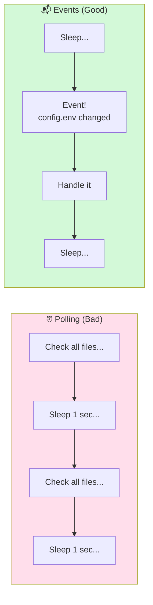
```mermaid
flowchart LR
    subgraph POLL["⏰ Polling (Bad)"]
        P1["Check all files..."] --> P2["Sleep 1 sec..."]
        P2 --> P3["Check all files..."]
        P3 --> P4["Sleep 1 sec..."]
    end
    subgraph EVENT["📬 Events (Good)"]
        E1["Sleep..."] --> E2["Event!\nconfig.env changed"]
        E2 --> E3["Handle it"]
        E3 --> E4["Sleep..."]
    end
    
    style POLL fill:#ffdeeb
    style EVENT fill:#d3f9d8
```

### 3.3 What Is Event Debouncing?

When you save a file in your editor, the OS often generates **multiple events** for what feels like a single save:

1. WRITE (editor writes content)
2. CHMOD (editor sets permissions)
3. WRITE (editor flushes to disk)
4. RENAME (editor does atomic save: write temp file, rename over original)

Without debouncing, CredVigil would scan the file **four times** for one save action. That's wasteful.

**Debouncing** collapses multiple rapid events for the same file into a single event.

**Everyday Analogy**: An elevator door. When someone presses the "open" button, the door opens and waits. If someone else presses it again within 3 seconds, the door doesn't close and reopen — it just stays open. The elevator "debounces" the button presses.

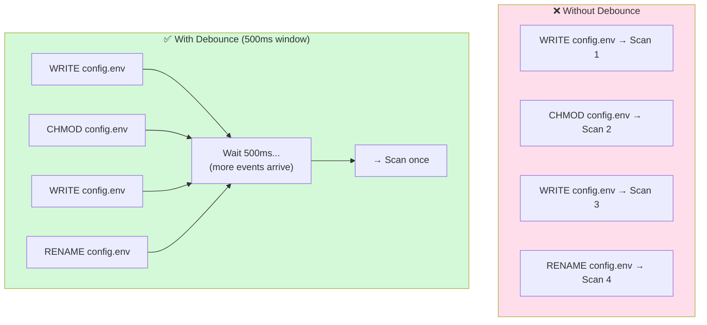
```mermaid
flowchart TB
    subgraph WITHOUT["❌ Without Debounce"]
        E1["WRITE config.env → Scan 1"]
        E2["CHMOD config.env → Scan 2"]
        E3["WRITE config.env → Scan 3"]
        E4["RENAME config.env → Scan 4"]
    end
    
    subgraph WITH["✅ With Debounce (500ms window)"]
        D1["WRITE config.env"] --> WAIT["Wait 500ms...\n(more events arrive)"]
        D2["CHMOD config.env"] --> WAIT
        D3["WRITE config.env"] --> WAIT
        D4["RENAME config.env"] --> WAIT
        WAIT --> SCAN["→ Scan once"]
    end
    
    style WITHOUT fill:#ffdeeb
    style WITH fill:#d3f9d8
```

#### How CredVigil's Debounce Works

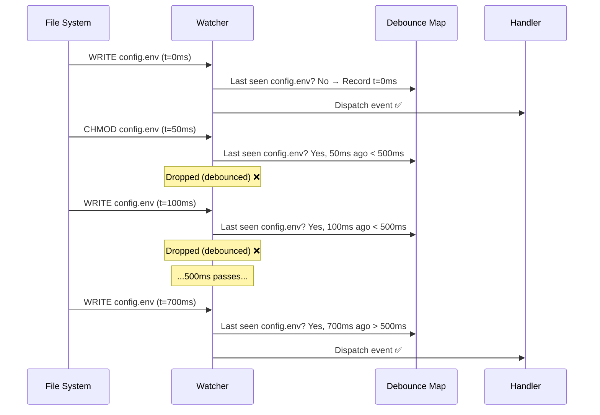
```mermaid
sequenceDiagram
    participant FS as File System
    participant W as Watcher
    participant DB as Debounce Map
    participant H as Handler
    
    FS->>W: WRITE config.env (t=0ms)
    W->>DB: Last seen config.env? No → Record t=0ms
    W->>H: Dispatch event ✅
    
    FS->>W: CHMOD config.env (t=50ms)
    W->>DB: Last seen config.env? Yes, 50ms ago < 500ms
    Note over W: Dropped (debounced) ❌
    
    FS->>W: WRITE config.env (t=100ms)
    W->>DB: Last seen config.env? Yes, 100ms ago < 500ms
    Note over W: Dropped (debounced) ❌
    
    Note over W: ...500ms passes...
    
    FS->>W: WRITE config.env (t=700ms)
    W->>DB: Last seen config.env? Yes, 700ms ago > 500ms
    W->>H: Dispatch event ✅
```

> **Interview Tip**: "CredVigil uses time-based debouncing with a configurable interval (default 500ms). For each file path, we store the timestamp of the last emitted event. If a new event for the same file arrives within the debounce window, it's dropped. This prevents redundant scans without missing genuine changes."

### 3.4 What Is Recursive Watching?

When you watch a directory, you have two choices:

1. **Non-recursive**: Watch only the top-level directory. Changes in subdirectories are invisible.
2. **Recursive**: Watch the directory and all its subdirectories, no matter how deep.

**Everyday Analogy**: Recursive watching is like installing security cameras on every floor of a building, not just the lobby.

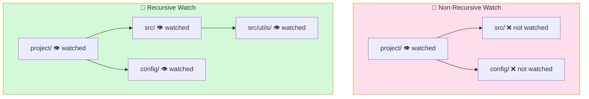
```mermaid
flowchart TB
    subgraph NONRECURSIVE["📁 Non-Recursive Watch"]
        NR_ROOT["project/ 👁️ watched"]
        NR_SRC["src/ ❌ not watched"]
        NR_CFG["config/ ❌ not watched"]
        NR_ROOT --> NR_SRC
        NR_ROOT --> NR_CFG
    end
    
    subgraph RECURSIVE["📁 Recursive Watch"]
        R_ROOT["project/ 👁️ watched"]
        R_SRC["src/ 👁️ watched"]
        R_UTIL["src/utils/ 👁️ watched"]
        R_CFG["config/ 👁️ watched"]
        R_ROOT --> R_SRC
        R_SRC --> R_UTIL
        R_ROOT --> R_CFG
    end
    
    style NONRECURSIVE fill:#ffdeeb
    style RECURSIVE fill:#d3f9d8
```

#### Dynamic Subdirectory Watching

When recursive mode is enabled and a new subdirectory is created, CredVigil automatically starts watching it:

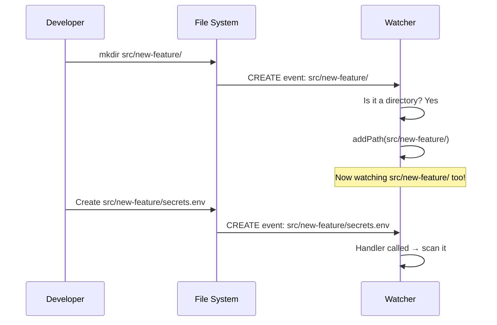
```mermaid
sequenceDiagram
    participant D as Developer
    participant FS as File System
    participant W as Watcher
    
    D->>FS: mkdir src/new-feature/
    FS->>W: CREATE event: src/new-feature/
    W->>W: Is it a directory? Yes
    W->>W: addPath(src/new-feature/)
    Note over W: Now watching src/new-feature/ too!
    
    D->>FS: Create src/new-feature/secrets.env
    FS->>W: CREATE event: src/new-feature/secrets.env
    W->>W: Handler called → scan it
```

> **Interview Tip**: "fsnotify doesn't natively support recursive watching — it watches individual directories. CredVigil implements recursion by walking the directory tree at startup and adding each subdirectory individually. When a CREATE event fires for a new directory, we dynamically add it to the watch list. This is a common pattern — Docker uses the same approach."

### 3.5 What Is a Callback?

A **callback** is a function you give to another function, saying "call this when something happens."

**Everyday Analogy**: You tell a restaurant "call me when my table is ready" and give them your phone number. Your phone number is the callback — the restaurant doesn't know what you'll do when they call, they just call the number you gave them.

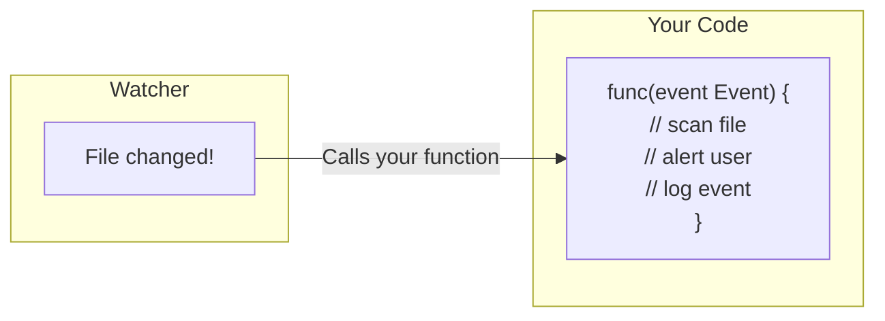
```mermaid
flowchart LR
    subgraph WATCHER["Watcher"]
        EVT["File changed!"]
    end
    subgraph YOUR_CODE["Your Code"]
        HANDLER["func(event Event) {\n  // scan file\n  // alert user\n  // log event\n}"]
    end
    EVT -->|"Calls your function"| HANDLER
```

In CredVigil, the callback is the `Handler` type:

```go
type Handler func(event Event)
```

You provide this function when creating the watcher. It gets called every time a (debounced, filtered) file event occurs.

#### Why Callbacks Instead of Channels?

| Pattern | Pros | Cons |
|---------|------|------|
| **Callback (CredVigil's choice)** | Simple API, clear ownership, handler can be anything | Harder to merge multiple handlers |
| **Channel** | Go-idiomatic, composable, easy fan-out | Requires goroutine management, backpressure handling |

> **Interview Tip**: "We chose callbacks because they're the simplest API for the consumer. The handler can do anything — scan the file, log it, send an alert, update a UI. The watcher doesn't need to know. This follows the Hollywood Principle: 'Don't call us, we'll call you.'"

### 3.6 What Is Context Cancellation?

Go's `context.Context` is a way to signal "stop what you're doing" to running goroutines. It's like a kill switch for background work.

**Everyday Analogy**: A walkie-talkie. The boss says "all units, stand down" into the walkie-talkie, and every team member hears it and stops. The `context.WithCancel()` function creates this walkie-talkie, and `cancel()` is the "stand down" command.

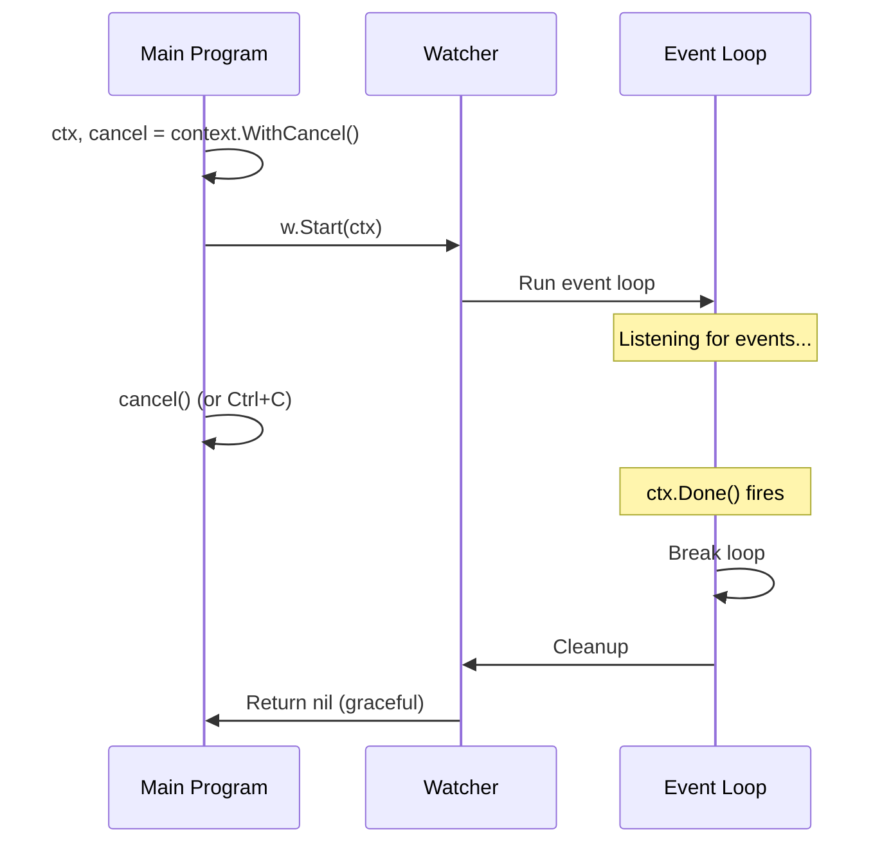
```mermaid
sequenceDiagram
    participant M as Main Program
    participant W as Watcher
    participant EL as Event Loop
    
    M->>M: ctx, cancel = context.WithCancel()
    M->>W: w.Start(ctx)
    W->>EL: Run event loop
    Note over EL: Listening for events...
    
    M->>M: cancel() (or Ctrl+C)
    Note over EL: ctx.Done() fires
    EL->>EL: Break loop
    EL->>W: Cleanup
    W->>M: Return nil (graceful)
```

> **Interview Tip**: "Context cancellation is Go's standard mechanism for cooperative goroutine termination. It's propagated through function calls — if a parent context is cancelled, all derived contexts are cancelled too. This makes it trivial to shut down an entire tree of goroutines with a single cancel() call."

### 3.7 What Is Concurrency Safety?

When multiple goroutines access the same data simultaneously, things can go wrong — a **race condition**. CredVigil's watcher uses several techniques to prevent this:

| Technique | Where Used | Why |
|-----------|-----------|-----|
| `sync.RWMutex` | Stats counters, running flag | Allows many readers OR one writer |
| `sync.Mutex` | Debounce map | Exclusive access to the debounce timestamps |
| Goroutine dispatch | Handler calls | Each handler runs in its own goroutine (non-blocking) |

**Everyday Analogy**: A whiteboard in an office. Many people can read it at the same time (RLock). But when someone needs to write on it, they put up a "please wait" sign so nobody reads stale data (Lock).

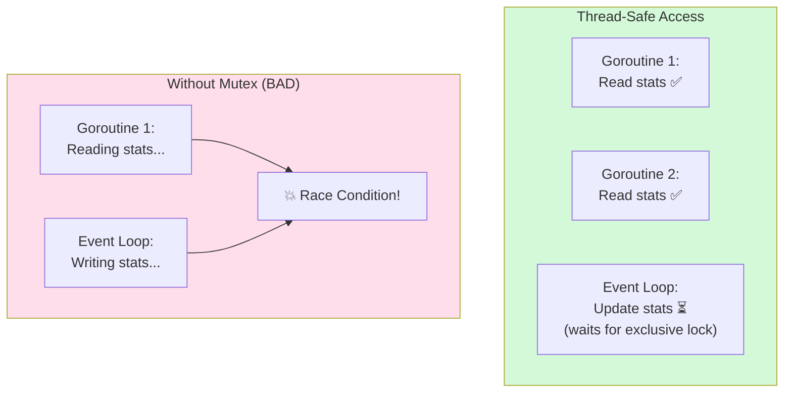
```mermaid
flowchart TB
    subgraph SAFE["Thread-Safe Access"]
        READ1["Goroutine 1:\nRead stats ✅"]
        READ2["Goroutine 2:\nRead stats ✅"]
        WRITE["Event Loop:\nUpdate stats ⏳\n(waits for exclusive lock)"]
    end
    
    subgraph UNSAFE["Without Mutex (BAD)"]
        UR1["Goroutine 1:\nReading stats..."]
        UW["Event Loop:\nWriting stats..."]
        BOOM["💥 Race Condition!"]
        UR1 --> BOOM
        UW --> BOOM
    end
    
    style SAFE fill:#d3f9d8
    style UNSAFE fill:#ffdeeb
```

> **Interview Tip**: "The watcher's stats use a RWMutex because reads vastly outnumber writes. Multiple goroutines can call GetStats() simultaneously without blocking each other. Only the event loop thread takes a write lock when incrementing counters. This is a classic reader-writer lock pattern."

### 3.8 What Are Exclusion Patterns?

Not every file change needs scanning. CredVigil's watcher ignores:

| Category | Examples | Why |
|----------|----------|-----|
| **Directories** | `.git`, `node_modules`, `vendor`, `.venv`, `__pycache__` | Build artifacts, dependencies — not your code |
| **Extensions** | `.exe`, `.png`, `.zip`, `.pdf`, `.lock`, `.sum` | Binary files, media, lock files — can't contain plain-text secrets |
| **Files** | `package-lock.json`, `yarn.lock`, `go.sum`, `Cargo.lock` | Auto-generated files — not authored by developers |

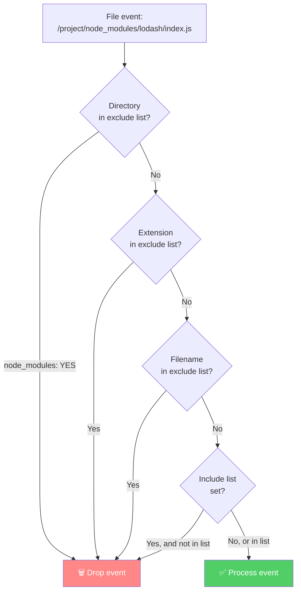
```mermaid
flowchart TB
    EVENT["File event:\n/project/node_modules/lodash/index.js"]
    EVENT --> CHECK_DIR{"Directory\nin exclude list?"}
    CHECK_DIR -->|"node_modules: YES"| DROP["🗑️ Drop event"]
    CHECK_DIR -->|"No"| CHECK_EXT{"Extension\nin exclude list?"}
    CHECK_EXT -->|"Yes"| DROP
    CHECK_EXT -->|"No"| CHECK_FILE{"Filename\nin exclude list?"}
    CHECK_FILE -->|"Yes"| DROP
    CHECK_FILE -->|"No"| CHECK_INCLUDE{"Include list\nset?"}
    CHECK_INCLUDE -->|"Yes, and not in list"| DROP
    CHECK_INCLUDE -->|"No, or in list"| PASS["✅ Process event"]
    
    style DROP fill:#ff8787,color:white
    style PASS fill:#51cf66,color:white
```

#### Include vs. Exclude Logic

| Mode | Behavior | Use Case |
|------|----------|----------|
| **Exclude only** | Watch everything except listed patterns | Default — broad monitoring |
| **Include only** | Watch ONLY listed extensions | Focused — "only scan .go and .py files" |
| **Both** | Include filter applied first, then exclude filter | Precise — "scan .env files, but not in node_modules" |

> **Interview Tip**: "The exclusion list mirrors what the detection engine already ignores — binary files, build output, dependency directories. This is important because scanning these files would waste CPU and generate false positives. The watcher filters events at the source, so the detection engine never even sees them."

### 3.9 What Is an Event Loop?

An **event loop** is a programming pattern where your program sits in a loop, waiting for events, and processes them one at a time.

**Everyday Analogy**: A receptionist sitting at a desk, waiting for the phone to ring. When it rings, they answer, handle the call, and then wait for the next one. They don't go looking for calls — calls come to them.

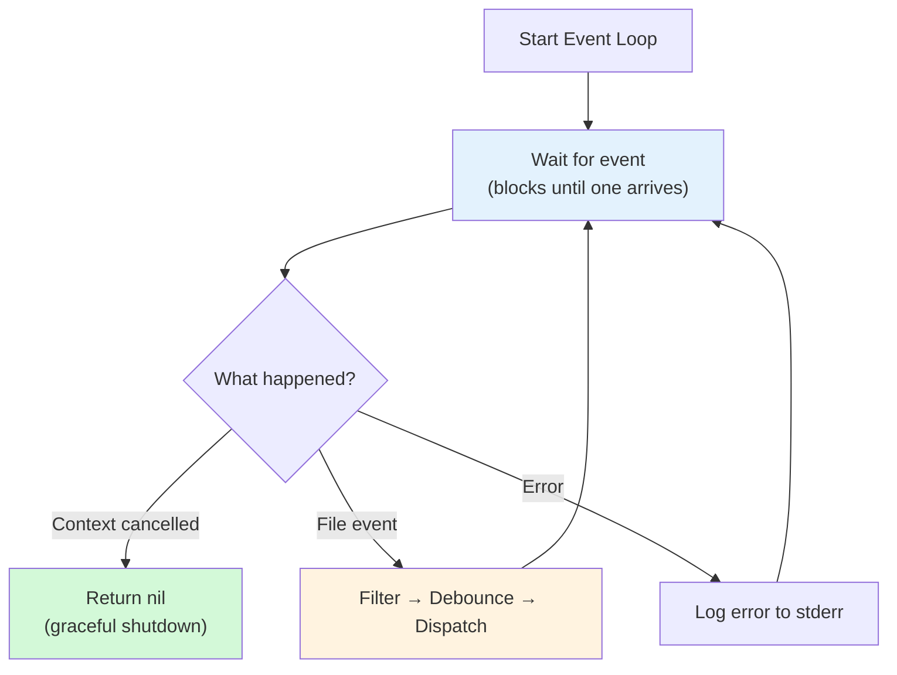
```mermaid
flowchart TB
    START["Start Event Loop"] --> WAIT["Wait for event\n(blocks until one arrives)"]
    WAIT --> EVENT{"What happened?"}
    EVENT -->|"Context cancelled"| STOP["Return nil\n(graceful shutdown)"]
    EVENT -->|"File event"| PROCESS["Filter → Debounce → Dispatch"]
    EVENT -->|"Error"| LOG["Log error to stderr"]
    PROCESS --> WAIT
    LOG --> WAIT
    
    style WAIT fill:#e3f2fd
    style STOP fill:#d3f9d8
    style PROCESS fill:#fff3e0
```

In Go, the event loop uses a `select` statement to wait on multiple channels simultaneously:

```go
select {
case <-ctx.Done():       // Context cancelled → stop
case event := <-fsw.Events:  // File changed → process
case err := <-fsw.Errors:    // Error → log
}
```

> **Interview Tip**: "Go's select statement is perfect for event loops because it blocks until one of multiple channels is ready, with no busy-waiting. This is more efficient than polling and more readable than manual epoll/kqueue. The select picks whichever channel fires first — if context is cancelled while waiting for a file event, we exit immediately."

### 3.10 What Is Graceful Shutdown?

**Graceful shutdown** means stopping cleanly — finishing what you're doing, cleaning up resources, and exiting without errors or data loss.

**Everyday Analogy**: When a restaurant closes, the staff doesn't just walk out. They finish serving current customers, clean the kitchen, lock the doors, and then leave. That's graceful shutdown.

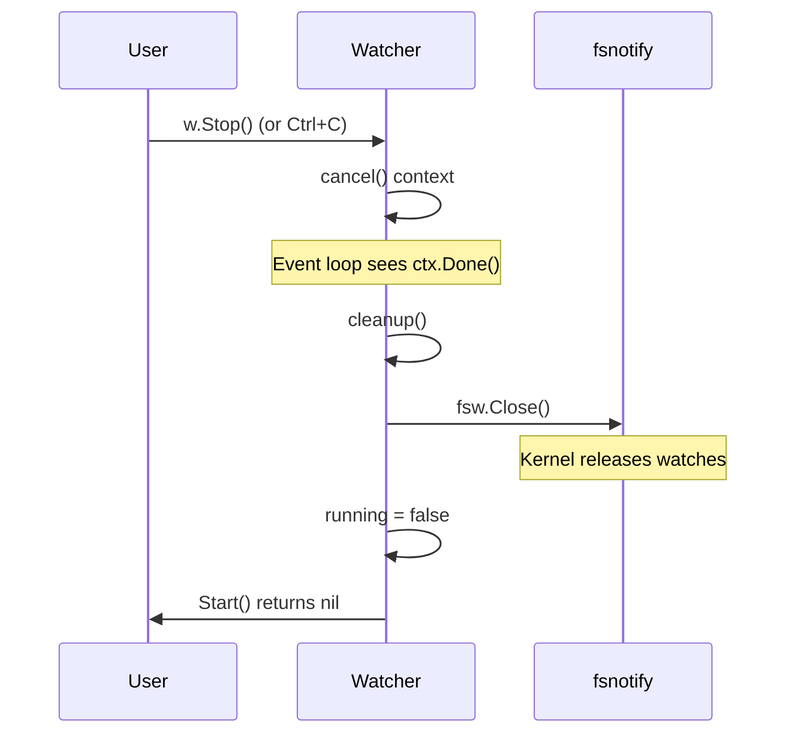
```mermaid
sequenceDiagram
    participant U as User
    participant W as Watcher
    participant FS as fsnotify

    U->>W: w.Stop() (or Ctrl+C)
    W->>W: cancel() context
    Note over W: Event loop sees ctx.Done()
    W->>W: cleanup()
    W->>FS: fsw.Close()
    Note over FS: Kernel releases watches
    W->>W: running = false
    W->>U: Start() returns nil
```

CredVigil's watcher guarantees:
1. The event loop exits cleanly when the context is cancelled
2. The fsnotify watcher is closed (releasing OS resources)
3. The `running` flag is set to false
4. `Start()` returns `nil` (no error for a graceful shutdown)

> **Interview Tip**: "Graceful shutdown is critical for long-running processes. Without it, you'll leak file descriptors (inotify watches), leave kernel resources allocated, or corrupt state. CredVigil uses `defer w.cleanup()` at the top of the event loop to guarantee cleanup even if there's a panic."

---

## 4. Architecture Overview

The File System Watcher is contained in a single file with a clean separation of concerns:

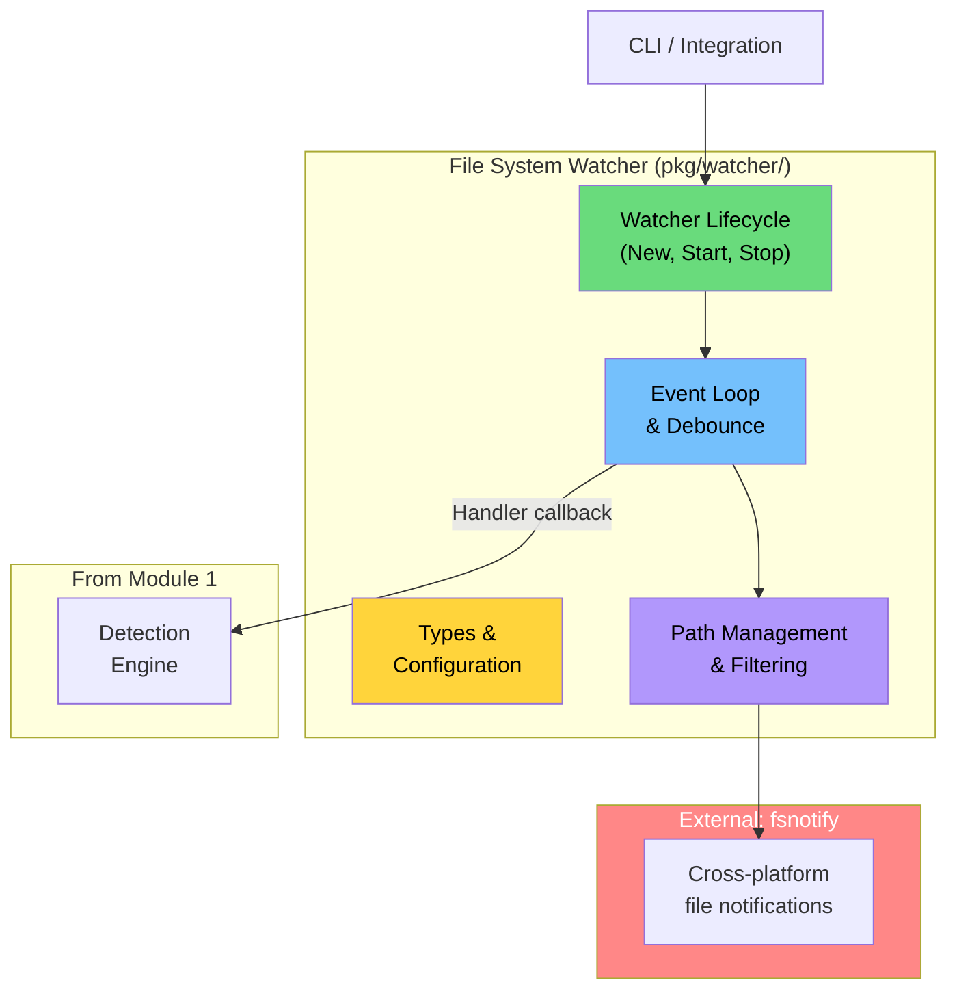
```mermaid
flowchart TB
    subgraph LAYER["File System Watcher (pkg/watcher/)"]
        TYPES["Types &\nConfiguration"]
        LIFECYCLE["Watcher Lifecycle\n(New, Start, Stop)"]
        EVENTLOOP["Event Loop\n& Debounce"]
        PATHS["Path Management\n& Filtering"]
    end
    
    subgraph FSNOTIFY["External: fsnotify"]
        FSW["Cross-platform\nfile notifications"]
    end
    
    subgraph ENGINE["From Module 1"]
        DET["Detection\nEngine"]
    end
    
    CLI["CLI / Integration"] --> LIFECYCLE
    LIFECYCLE --> EVENTLOOP
    EVENTLOOP --> PATHS
    PATHS --> FSW
    EVENTLOOP -->|"Handler callback"| DET
    
    style TYPES fill:#ffd43b,color:black
    style LIFECYCLE fill:#69db7c,color:black
    style EVENTLOOP fill:#74c0fc,color:black
    style PATHS fill:#b197fc,color:black
    style FSNOTIFY fill:#ff8787,color:white
```

### How Each Section Relates

| Section | Role | Analogy |
|---------|------|---------|
| **Types & Config** | Defines event types, handler signature, configuration struct | The **rulebook** — what events look like and what options are available |
| **Watcher Lifecycle** | Creates, starts, and stops the watcher | The **power button** — turn monitoring on and off |
| **Event Loop & Debounce** | Core loop that receives, filters, debounces, and dispatches events | The **brain** — decides what to do with each event |
| **Path Management & Filtering** | Adds directories to watch, decides which files to skip | The **security checkpoint** — decides who gets in |

> **Interview Tip**: "Even though it's a single file, the watcher has clear separation of concerns: types at the top, lifecycle in the middle, event loop core, and utility functions at the bottom. This makes it easy to test each concern independently — you can test filtering without starting the event loop, or test debounce without touching the file system."

### Data Flow Between Sections

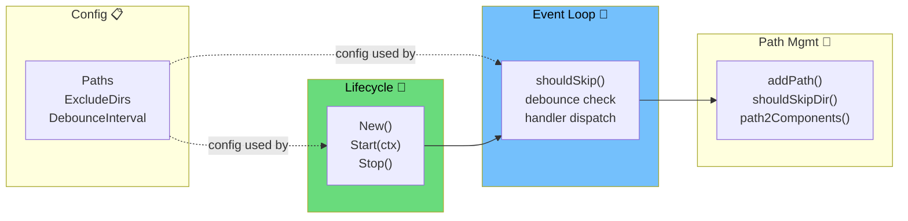
```mermaid
flowchart LR
    subgraph CONFIG["Config 📋"]
        C["Paths\nExcludeDirs\nDebounceInterval"]
    end
    subgraph LIFECYCLE["Lifecycle 🔄"]
        L["New()\nStart(ctx)\nStop()"]
    end
    subgraph LOOP["Event Loop 🧠"]
        EL["shouldSkip()\ndebounce check\nhandler dispatch"]
    end
    subgraph PATHS["Path Mgmt 📁"]
        P["addPath()\nshouldSkipDir()\npath2Components()"]
    end
    
    C -.->|"config used by"| L
    C -.->|"config used by"| EL
    L --> EL
    EL --> P
    
    style LIFECYCLE fill:#69db7c,color:black
    style LOOP fill:#74c0fc,color:black
```

---

## 5. The Source Files

### 5.1 watcher.go — Types and Configuration

#### EventType

Represents the kind of file system event:

```go
type EventType int

const (
    EventCreated  EventType = iota // File or directory was created
    EventModified                  // File was written to
    EventDeleted                   // File or directory was removed
    EventRenamed                   // File or directory was renamed
)
```

**Analogy**: A label system — like "NEW," "UPDATED," "REMOVED," and "MOVED" stickers on documents in a filing cabinet.

```mermaid
flowchart LR
    subgraph TYPES["EventType Enum"]
        C["EventCreated = 0"]
        M["EventModified = 1"]
        D["EventDeleted = 2"]
        R["EventRenamed = 3"]
    end
    
    C --> CS["String() → 'CREATED'"]
    M --> MS["String() → 'MODIFIED'"]
    D --> DS["String() → 'DELETED'"]
    R --> RS["String() → 'RENAMED'"]
```

#### Event

A debounced, filtered event ready for processing:

```go
type Event struct {
    Path      string    // Absolute path to the changed file
    Type      EventType // CREATED, MODIFIED, DELETED, or RENAMED
    Timestamp time.Time // When the event was captured
}
```

**Analogy**: A security report slip — it tells you *where* something happened, *what* happened, and *when*.

#### Handler

The callback function signature:

```go
type Handler func(event Event)
```

You provide this function. The watcher calls it for every processed event. It should be safe for concurrent invocation because events dispatch in goroutines.

#### Config

The configuration struct controls everything about how the watcher behaves:

```go
type Config struct {
    Paths             []string      // Directories/files to watch
    Recursive         bool          // Watch subdirectories?
    DebounceInterval  time.Duration // Min time between same-file events
    ExcludeDirs       []string      // Directory names to skip
    ExcludeExtensions []string      // File extensions to skip
    ExcludeFiles      []string      // Exact filenames to skip
    IncludeExtensions []string      // If set, ONLY watch these extensions
}
```

```mermaid
flowchart TB
    CONFIG["Config"]
    CONFIG --> PATHS["Paths\n['./src/', './config/']"]
    CONFIG --> RECURSIVE["Recursive\ntrue (watch subdirs)"]
    CONFIG --> DEBOUNCE["DebounceInterval\n500ms (default)"]
    CONFIG --> EXCL_DIR["ExcludeDirs\n['.git', 'node_modules', ...]"]
    CONFIG --> EXCL_EXT["ExcludeExtensions\n['.exe', '.png', ...]"]
    CONFIG --> EXCL_FILE["ExcludeFiles\n['package-lock.json', ...]"]
    CONFIG --> INCL_EXT["IncludeExtensions\n['.go', '.py'] (optional)"]
```

#### DefaultConfig

Returns a production-ready configuration:

```go
func DefaultConfig() Config {
    return Config{
        Recursive:        true,
        DebounceInterval: 500 * time.Millisecond,
        ExcludeDirs:      []string{".git", "node_modules", "vendor", ...},
        ExcludeExtensions: []string{".exe", ".dll", ".png", ".zip", ...},
        ExcludeFiles:      []string{"package-lock.json", "yarn.lock", ...},
    }
}
```

The defaults mirror the detection engine's exclusion patterns — no point watching files the scanner would skip anyway.

> **Interview Tip**: "DefaultConfig follows the Convention-over-Configuration principle. Out of the box, it does the right thing: recursive watching, sensible debounce, and skipping binary/generated files. Users only override what they need. This reduces the configuration surface area from 7 fields to usually 1 (just Paths)."

#### Stats

Runtime statistics with thread-safe access:

```go
type Stats struct {
    mu             sync.RWMutex
    EventsReceived uint64    // Total raw events from fsnotify
    EventsEmitted  uint64    // Events that passed filtering + debounce
    EventsDropped  uint64    // Events filtered out or debounced
    DirsWatched    int       // Number of directories being watched
    StartedAt      time.Time // When the watcher was started
}
```

```mermaid
flowchart LR
    RAW["100 raw events"] --> FILTER["Filter + Debounce"]
    FILTER --> EMITTED["25 emitted"]
    FILTER --> DROPPED["75 dropped"]
    
    subgraph STATS["Stats"]
        SR["EventsReceived: 100"]
        SE["EventsEmitted: 25"]
        SD["EventsDropped: 75"]
    end
```

The `Snapshot()` method returns a copy of the stats, using a read lock so it doesn't block the event loop:

```go
func (s *Stats) Snapshot() Stats {
    s.mu.RLock()
    defer s.mu.RUnlock()
    return Stats{
        EventsReceived: s.EventsReceived,
        // ... copy all fields
    }
}
```

### 5.2 watcher.go — Core Watcher Implementation

#### The Watcher Struct

```go
type Watcher struct {
    config   Config              // What to watch and how
    handler  Handler             // Callback for events
    fsw      *fsnotify.Watcher   // The underlying OS watcher
    stats    Stats               // Runtime statistics
    mu       sync.RWMutex        // Protects running flag
    running  bool                // Is the watcher active?
    cancelFn context.CancelFunc  // Shutdown trigger
}
```

```mermaid
flowchart TB
    subgraph WATCHER["Watcher Struct"]
        direction TB
        CFG["config: Config\n(what to watch)"]
        HDL["handler: Handler\n(what to do)"]
        FSW["fsw: *fsnotify.Watcher\n(OS interface)"]
        STS["stats: Stats\n(counters)"]
        MU["mu: RWMutex\n(concurrency guard)"]
        RUN["running: bool\n(active flag)"]
        CAN["cancelFn: CancelFunc\n(shutdown trigger)"]
    end
    
    style CFG fill:#ffd43b,color:black
    style HDL fill:#69db7c,color:black
    style FSW fill:#74c0fc,color:black
    style STS fill:#b197fc,color:black
```

#### New() — Constructor

```go
func New(cfg Config, handler Handler) (*Watcher, error)
```

Validates inputs and creates the watcher:

```mermaid
flowchart TB
    NEW["New(config, handler)"]
    NEW --> CHECK_H{"handler nil?"}
    CHECK_H -->|"Yes"| ERR1["Error: handler required"]
    CHECK_H -->|"No"| CHECK_P{"paths empty?"}
    CHECK_P -->|"Yes"| ERR2["Error: paths required"]
    CHECK_P -->|"No"| CHECK_D{"debounce ≤ 0?"}
    CHECK_D -->|"Yes"| DEFAULT["Set to 500ms"]
    CHECK_D -->|"No"| KEEP["Keep as-is"]
    DEFAULT --> CREATE["Create fsnotify.Watcher"]
    KEEP --> CREATE
    CREATE --> RETURN["Return &Watcher{}"]
    
    style ERR1 fill:#ff8787,color:white
    style ERR2 fill:#ff8787,color:white
    style RETURN fill:#69db7c,color:black
```

#### Start() — Begin Watching

```go
func (w *Watcher) Start(ctx context.Context) error
```

1. Checks if already running (prevents double-start)
2. Sets `running = true`
3. Creates a cancellable context
4. Adds all configured paths to fsnotify
5. Runs the event loop (blocks until cancelled)

```mermaid
sequenceDiagram
    participant C as Caller
    participant W as Watcher
    participant FS as fsnotify
    participant OS as Kernel
    
    C->>W: Start(ctx)
    W->>W: Check not already running
    W->>W: running = true
    W->>W: Create cancel context
    
    loop For each path in config
        W->>FS: addPath(path)
        FS->>OS: Register inotify/kqueue watch
    end
    
    W->>W: eventLoop(ctx) — blocks
    Note over W: Processing events...
    
    Note over C: cancel() called
    W->>W: eventLoop returns
    W->>W: cleanup()
    W->>C: Return nil
```

#### Stop() — Signal Shutdown

```go
func (w *Watcher) Stop()
```

Simply calls the cancel function, which triggers `ctx.Done()` in the event loop. The event loop then exits and runs cleanup.

> **Interview Tip**: "Start() is a blocking call — it doesn't return until the context is cancelled. This is intentional. The caller runs it in a goroutine via `go w.Start(ctx)` and uses `w.Stop()` or `cancel()` to shut it down. This pattern keeps the lifecycle explicit and testable."

### 5.3 watcher.go — Event Loop and Debounce

#### The Event Loop

This is the heart of the watcher — a `for`/`select` loop that processes three channels:

```go
for {
    select {
    case <-ctx.Done():          // 1. Shutdown signal
        return nil
    case fsEvent := <-w.fsw.Events:  // 2. File system event
        // Filter → Debounce → Dispatch
    case err := <-w.fsw.Errors:      // 3. OS error
        // Log to stderr
    }
}
```

```mermaid
flowchart TB
    subgraph EVENTLOOP["Event Loop (runs forever until cancelled)"]
        SELECT["select { ... }"]
        SELECT --> CTX["ctx.Done()\n→ return nil"]
        SELECT --> FSE["fsw.Events\n→ process event"]
        SELECT --> ERR["fsw.Errors\n→ log error"]
        
        FSE --> RECV["stats.EventsReceived++"]
        RECV --> SKIP{"shouldSkip(path)?"}
        SKIP -->|"Yes"| DROP["stats.EventsDropped++\nContinue"]
        SKIP -->|"No"| DIR{"Is new directory?"}
        DIR -->|"Yes"| ADD["addPath()\nContinue"]
        DIR -->|"No"| DEBOUNCE{"Within debounce\nwindow?"}
        DEBOUNCE -->|"Yes"| DROP2["stats.EventsDropped++\nContinue"]
        DEBOUNCE -->|"No"| EMIT["Create Event\nstats.EventsEmitted++\ngo handler(event)"]
    end
    
    DROP --> SELECT
    DROP2 --> SELECT
    ADD --> SELECT
    EMIT --> SELECT
    ERR --> SELECT
    
    style CTX fill:#69db7c,color:black
    style DROP fill:#ff8787,color:white
    style DROP2 fill:#ff8787,color:white
    style EMIT fill:#4dabf7,color:white
```

#### Key Design Decisions in the Event Loop

| Decision | Rationale |
|----------|-----------|
| **Goroutine dispatch** (`go w.handler(event)`) | Handlers might be slow (scanning large files). Non-blocking dispatch prevents the event loop from stalling. |
| **Directory auto-watch** | When a CREATE event fires for a directory, we add it to the watch list. This enables dynamic recursive watching. |
| **Error logging, not crashing** | OS-level errors (permission denied, too many watches) are logged to stderr but don't crash the watcher. |
| **Stats under mutex** | Every counter update is protected by a mutex to prevent race conditions from concurrent goroutines. |

### 5.4 watcher.go — Path Management and Filtering

#### addPath() — Register a Watch

```go
func (w *Watcher) addPath(path string) error
```

Handles both files and directories:

```mermaid
flowchart TB
    ADD["addPath(path)"]
    ADD --> STAT["os.Stat(path)"]
    STAT --> IS_DIR{"Is directory?"}
    IS_DIR -->|"No (file)"| ADD_FILE["fsw.Add(file)"]
    IS_DIR -->|"Yes"| RECURSIVE{"config.Recursive?"}
    RECURSIVE -->|"No"| ADD_DIR["fsw.Add(dir)\nstats.DirsWatched++"]
    RECURSIVE -->|"Yes"| WALK["filepath.Walk(dir)"]
    WALK --> EACH{"For each subdir"}
    EACH --> SKIP{"shouldSkipDir(name)?"}
    SKIP -->|"Yes"| SKIPDIR["filepath.SkipDir"]
    SKIP -->|"No"| ADD_SUB["fsw.Add(subdir)\nstats.DirsWatched++"]
```

The recursive walk uses `filepath.Walk`, which traverses the entire directory tree depth-first. Each subdirectory is individually added to fsnotify.

#### shouldSkip() — File Filtering

```go
func (w *Watcher) shouldSkip(path string) bool
```

The filtering pipeline runs top-to-bottom, returning `true` at the first match:

```mermaid
flowchart TB
    PATH["shouldSkip('/project/node_modules/lodash/index.js')"]
    PATH --> DECOMPOSE["path2Components()\n→ ['lodash', 'node_modules', 'project']"]
    DECOMPOSE --> CHECK_DIRS{"Any component\nin ExcludeDirs?"}
    CHECK_DIRS -->|"'node_modules' matches!"| SKIP_TRUE["return true ✅ Skip"]
    CHECK_DIRS -->|"No match"| CHECK_FILE{"Base filename\nin ExcludeFiles?"}
    CHECK_FILE -->|"Yes"| SKIP_TRUE
    CHECK_FILE -->|"No"| CHECK_EXT{"Extension in\nExcludeExtensions?"}
    CHECK_EXT -->|"Yes"| SKIP_TRUE
    CHECK_EXT -->|"No"| CHECK_INCL{"IncludeExtensions\nset?"}
    CHECK_INCL -->|"Not set"| SKIP_FALSE["return false ❌ Don't skip"]
    CHECK_INCL -->|"Set, and ext matches"| SKIP_FALSE
    CHECK_INCL -->|"Set, but ext doesn't match"| SKIP_TRUE
    
    style SKIP_TRUE fill:#ff8787,color:white
    style SKIP_FALSE fill:#69db7c,color:white
```

#### path2Components() — Path Decomposition

Splits a file path into its directory components for directory-level filtering:

```go
path2Components("/project/.git/config")
// Returns: [".git", "project"]
```

```mermaid
flowchart LR
    INPUT["/project/.git/config"]
    INPUT --> SPLIT["Split path"]
    SPLIT --> PARTS["['.git', 'project']"]
    PARTS --> CHECK["Check each against ExcludeDirs"]
    CHECK --> MATCH["'.git' matches → skip!"]
```

This is how the watcher detects that `/project/.git/refs/heads/main` should be skipped — the `.git` component is in the exclude list, even though it's not the file's immediate directory.

#### mapEventType() — Event Translation

Converts fsnotify's bitmask-style `Op` into CredVigil's clean enum:

```go
func mapEventType(op fsnotify.Op) EventType {
    switch {
    case op.Has(fsnotify.Create): return EventCreated
    case op.Has(fsnotify.Write):  return EventModified
    case op.Has(fsnotify.Remove): return EventDeleted
    case op.Has(fsnotify.Rename): return EventRenamed
    default:                      return EventModified
    }
}
```

```mermaid
flowchart LR
    subgraph FSNOTIFY_OPS["fsnotify.Op (bitmask)"]
        FC["Create"]
        FW["Write"]
        FR["Remove"]
        FN["Rename"]
        FCH["Chmod"]
    end
    subgraph CREDVIGIL_TYPES["EventType (enum)"]
        EC["EventCreated"]
        EM["EventModified"]
        ED["EventDeleted"]
        ER["EventRenamed"]
    end
    
    FC --> EC
    FW --> EM
    FR --> ED
    FN --> ER
    FCH --> EM
```

> **Design decision**: fsnotify's `Chmod` is mapped to `EventModified` because permission changes don't affect file content — but the default fallback reports it as a modification for safety.

---

## 6. How It All Fits Together

Here is the complete flow showing how Component 4 integrates with the existing CredVigil components:

```mermaid
flowchart TB
    subgraph CLI["Integration Point"]
        CMD["credvigil watch ./src/"]
    end
    
    subgraph C4["Component 4: File System Watcher"]
        CONFIG["Apply Config\n(defaults + overrides)"]
        REGISTER["Register directories\nwith fsnotify"]
        LOOP["Event Loop\n(select on channels)"]
        FILTER["Filter + Debounce"]
        DISPATCH["Dispatch to Handler"]
    end
    
    subgraph C1["Component 1: Detection Engine"]
        ENGINE["ScanContent\n369 rules + entropy"]
    end
    
    subgraph C2["Component 2: Pipeline"]
        HASH["Hash"]
        REDACT["Redact"]
        ENRICH["Enrich"]
        FP["Fingerprint"]
        SANITIZE["Sanitize"]
    end
    
    subgraph OUTPUT["Output"]
        ALERT["Real-time Alert\nTerminal / Webhook / IDE"]
    end
    
    CMD --> CONFIG --> REGISTER --> LOOP
    LOOP --> FILTER --> DISPATCH
    DISPATCH --> ENGINE
    ENGINE --> HASH --> REDACT --> ENRICH --> FP --> SANITIZE
    SANITIZE --> ALERT
    
    style C4 fill:#fff3e0
    style C1 fill:#f3e5f5
    style C2 fill:#e8f5e9
```

> **Interview Tip**: "The watcher is a pure event producer. It doesn't know about secrets, rules, or pipelines. It just emits events with file paths and change types. The handler callback bridges the gap — in production, the handler reads the changed file and feeds it to the detection engine. This decoupling means you can swap the handler for any action: scan, log, sync, deploy."

#### The Four Components Working Together

```mermaid
flowchart TB
    subgraph PAST["🔍 Retrospective Detection"]
        M3["Module 3: Git Scanner\n'Find what already happened'"]
    end
    subgraph PRESENT["👁️ Real-Time Detection"]
        M4["Module 4: File Watcher\n'Catch it as it happens'"]
    end
    subgraph PROCESS["⚙️ Processing"]
        M1["Module 1: Detection Engine\n'Identify the secret'"]
        M2["Module 2: Pipeline\n'Secure the finding'"]
    end
    
    M3 --> M1
    M4 --> M1
    M1 --> M2
    M2 --> SAFE["Safe, actionable findings"]
    
    style PAST fill:#e3f2fd
    style PRESENT fill:#fff3e0
    style PROCESS fill:#f3e5f5
```

---

## 7. The Watching Flow Step by Step

Let's trace through a real example. A developer saves a file containing an AWS key.

### Step-by-Step Trace

```mermaid
sequenceDiagram
    participant D as Developer
    participant FS as File System
    participant FN as fsnotify
    participant W as Watcher Event Loop
    participant F as Filter/Debounce
    participant H as Handler
    participant E as Detection Engine

    D->>FS: Save config.env with AWS key
    FS->>FN: WRITE event: config.env
    FN->>W: fsEvent via Events channel
    W->>W: stats.EventsReceived++
    W->>F: shouldSkip("config.env")?
    F-->>W: false (not excluded)
    W->>F: Debounce check
    F-->>W: Not in window → proceed
    W->>W: stats.EventsEmitted++
    W->>H: go handler(Event{Path: "config.env", Type: MODIFIED})
    H->>E: Read file → ScanContent(content)
    E-->>H: Finding: AWS Secret Access Key!
    Note over H: Alert developer via terminal/webhook
```

### The Flow in Numbers

| Metric | Value | Explanation |
|--------|-------|-------------|
| Raw events from OS | 3 | WRITE + CHMOD + WRITE (typical save) |
| Events after filter | 3 | All for config.env (no exclusions) |
| Events after debounce | 1 | 3 events in 50ms → 1 emitted |
| Handler invocations | 1 | One scan for one logical change |
| Detection engine calls | 1 | Scans file content once |
| Findings | 1 | AWS key detected |

---

## 8. Integration with the Detection Engine

The watcher itself doesn't scan files — it detects *changes* and tells the handler *which file changed*. The handler is responsible for reading the file and feeding it to the detection engine.

### Example Integration

```go
// Create a handler that scans changed files
handler := func(event watcher.Event) {
    // Skip deletions — nothing to scan
    if event.Type == watcher.EventDeleted {
        return
    }
    
    // Read the changed file
    content, err := os.ReadFile(event.Path)
    if err != nil {
        return
    }
    
    // Create scan request
    req := models.ScanRequest{
        Content:  string(content),
        FilePath: event.Path,
    }
    
    // Run detection
    result := engine.ScanContent(req)
    
    // Process through pipeline
    result = pipeline.Process(result)
    
    // Alert on findings
    if len(result.Findings) > 0 {
        fmt.Printf("⚠️  %d secrets found in %s\n", len(result.Findings), event.Path)
    }
}

// Start watching
w, _ := watcher.New(watcher.Config{
    Paths: []string{"./src/"},
}, handler)

ctx, cancel := context.WithCancel(context.Background())
defer cancel()
w.Start(ctx)
```

```mermaid
flowchart LR
    subgraph HANDLER["Handler Function"]
        CHECK["Check event type"]
        READ["Read changed file"]
        SCAN["ScanContent()"]
        PIPE["Pipeline.Process()"]
        ALERT["Alert if findings"]
    end
    
    EVENT["Event from\nWatcher"] --> CHECK --> READ --> SCAN --> PIPE --> ALERT
    
    style HANDLER fill:#fff3e0
```

### Separation of Concerns

| Component | Responsibility | Does NOT do |
|-----------|---------------|-------------|
| **Watcher** | Detect file changes, filter, debounce | Read files, scan for secrets, send alerts |
| **Handler** | Bridge between watcher and engine | Watch files, debounce events |
| **Engine** | Find secrets in content | Know about file system events |
| **Pipeline** | Secure the findings | Know where the content came from |

> **Interview Tip**: "The watcher follows the Single Responsibility Principle — it only detects and reports file changes. It doesn't read files, scan content, or send alerts. The Handler callback is the seam between components. This makes the watcher reusable for any file-change-triggered action — not just secret scanning."

---

## 9. Understanding Watcher Output

### Event Output

Each event contains three fields:

```
Event{
    Path:      "/Users/dev/project/config.env",
    Type:      MODIFIED,
    Timestamp: 2026-03-14T10:00:00.123Z,
}
```

### Stats Output

The watcher tracks operational metrics:

```
Stats{
    EventsReceived: 150,      // Total raw events from OS
    EventsEmitted:  42,       // Events that reached the handler
    EventsDropped:  108,      // Filtered + debounced
    DirsWatched:    23,       // Active directory watches
    StartedAt:      10:00:00, // When monitoring began
}
```

```mermaid
flowchart LR
    subgraph FUNNEL["Event Funnel"]
        RAW["📥 150 received"]
        RAW --> FILTER_OUT["🗑️ 60 filtered\n(excluded dirs/exts)"]
        RAW --> DEBOUNCE_OUT["🗑️ 48 debounced\n(rapid duplicates)"]
        RAW --> EMITTED["✅ 42 emitted\n(to handler)"]
    end
    
    style RAW fill:#74c0fc,color:black
    style FILTER_OUT fill:#ff8787,color:white
    style DEBOUNCE_OUT fill:#ffd43b,color:black
    style EMITTED fill:#69db7c,color:black
```

> The funnel shows that most events are noise — directory exclusions, binary files, and rapid-fire saves all get filtered out, leaving only the meaningful changes.

---

## 10. Hands-On Exercises

### Exercise 1: Observe Raw File System Events

Without CredVigil, you can see what the OS reports when you save a file:

```bash
# macOS — watch for file system events
fswatch -r ./test-dir/

# Linux — watch with inotifywait
inotifywait -r -m ./test-dir/
```

In another terminal:
```bash
echo "hello" > ./test-dir/test.txt
```

**Observe**: How many events fire for one `echo >` command? You'll likely see 2–4 events. This is why debouncing matters.

### Exercise 2: Run the Watcher Tests

```bash
cd /path/to/credvigil

# Run all watcher tests
go test ./pkg/watcher/... -v

# You should see 22 tests pass:
# - Validation tests (nil handler, no paths)
# - Config defaults
# - Event type strings
# - Filtering (skip dirs, skip files, skip extensions, include extensions)
# - Start/stop lifecycle
# - File creation and modification detection
# - Debounce behavior
# - Recursive subdirectory watching
# - Stats tracking
# - Double-start prevention
```

### Exercise 3: Understand the Debounce

Look at the `TestWatcher_Debounce` test:

```go
// Writes 10 times with 10ms gaps, expects fewer than 10 handler calls
for i := 0; i < 10; i++ {
    writeFile(t, dir, "rapid.txt", "w"+string(rune('0'+i)))
    time.Sleep(10 * time.Millisecond)
}
time.Sleep(400 * time.Millisecond) // Wait for debounce window

if c := count.Load(); c >= 10 {
    t.Errorf("debounce failed: %d events", c)
}
```

**Question**: With a 200ms debounce interval and 10 writes at 10ms intervals (total ~100ms), how many events do you expect? **Answer**: 1 — all 10 writes happen within the debounce window of the first event.

### Exercise 4: Understand Exclusion Filtering

Write a small Go program that creates a watcher and checks what gets filtered:

```go
package main

import (
    "fmt"
    "github.com/svemulapati/CredVigil/pkg/watcher"
)

func main() {
    cfg := watcher.DefaultConfig()
    fmt.Printf("Excluded dirs: %v\n", cfg.ExcludeDirs)
    fmt.Printf("Excluded extensions: %v\n", cfg.ExcludeExtensions)
    fmt.Printf("Excluded files: %v\n", cfg.ExcludeFiles)
    
    // Count them
    fmt.Printf("\nTotal: %d dirs, %d extensions, %d files excluded by default\n",
        len(cfg.ExcludeDirs), len(cfg.ExcludeExtensions), len(cfg.ExcludeFiles))
}
```

### Exercise 5: Watch a Directory

Write a simple watcher that prints events as they happen:

```go
package main

import (
    "context"
    "fmt"
    "os"
    "os/signal"
    "syscall"
    
    "github.com/svemulapati/CredVigil/pkg/watcher"
)

func main() {
    dir := os.Args[1]
    
    w, err := watcher.New(watcher.Config{
        Paths:     []string{dir},
        Recursive: true,
    }, func(e watcher.Event) {
        fmt.Printf("[%s] %s — %s\n", e.Timestamp.Format("15:04:05"), e.Type, e.Path)
    })
    if err != nil {
        fmt.Fprintf(os.Stderr, "Error: %v\n", err)
        os.Exit(1)
    }
    
    ctx, cancel := context.WithCancel(context.Background())
    
    // Handle Ctrl+C
    sigs := make(chan os.Signal, 1)
    signal.Notify(sigs, syscall.SIGINT, syscall.SIGTERM)
    go func() {
        <-sigs
        fmt.Println("\nShutting down...")
        cancel()
    }()
    
    fmt.Printf("Watching %s (Ctrl+C to stop)...\n", dir)
    if err := w.Start(ctx); err != nil {
        fmt.Fprintf(os.Stderr, "Watcher error: %v\n", err)
    }
    
    stats := w.GetStats()
    fmt.Printf("Stats: %d received, %d emitted, %d dropped, %d dirs watched\n",
        stats.EventsReceived, stats.EventsEmitted, stats.EventsDropped, stats.DirsWatched)
}
```

Then in another terminal, create and modify files:
```bash
echo "test" > /watched-dir/test.txt
echo "AKIA1234567890ABCDEF" > /watched-dir/secrets.env
rm /watched-dir/test.txt
```

### Exercise 6: Measure Debounce Effectiveness

Modify Exercise 5 to show both raw and debounced event counts:

```bash
# Run your watcher from Exercise 5
# In another terminal, rapidly write to the same file:
for i in $(seq 1 50); do echo "write $i" > /watched-dir/burst.txt; done

# Check the stats output — how many of the 50 writes resulted in handler calls?
```

---

## 11. Deep Dive: Code Walkthrough

### 11.1 Event Types and Models

The event system uses a simple enum pattern in Go:

```go
type EventType int

const (
    EventCreated  EventType = iota  // 0
    EventModified                   // 1
    EventDeleted                    // 2
    EventRenamed                    // 3
)
```

The `iota` keyword auto-increments from 0. The `String()` method provides human-readable names:

```go
func (e EventType) String() string {
    switch e {
    case EventCreated:  return "CREATED"
    case EventModified: return "MODIFIED"
    case EventDeleted:  return "DELETED"
    case EventRenamed:  return "RENAMED"
    default:            return "UNKNOWN"
    }
}
```

> **Interview Tip**: "Using a typed enum (type EventType int) instead of bare strings gives you compile-time safety. You can't accidentally pass 'CRREATED' (typo) — the compiler catches it. The String() method provides the human-readable form for logging and display."

### 11.2 Configuration and Defaults

The `DefaultConfig()` function is carefully tuned:

**ExcludeDirs** (16 entries): Covers version control (`.git`), package managers (`node_modules`, `vendor`, `.venv`), IDEs (`.idea`, `.vscode`, `.vs`), build output (`dist`, `build`, `target`, `bin`, `obj`), infrastructure (`.terraform`), frameworks (`.next`, `.nuxt`), and testing (`coverage`).

**ExcludeExtensions** (32 entries): Covers executables (`.exe`, `.dll`, `.so`, `.dylib`), images (`.png`, `.jpg`, etc.), media (`.mp3`, `.mp4`, etc.), archives (`.zip`, `.tar`, `.gz`, etc.), documents (`.pdf`, `.doc`, etc.), fonts (`.woff`, `.ttf`, etc.), and lock files (`.lock`, `.sum`).

**ExcludeFiles** (7 entries): All lock files from major package managers — `package-lock.json`, `yarn.lock`, `go.sum`, `Cargo.lock`, `poetry.lock`, `Gemfile.lock`, `composer.lock`.

```mermaid
flowchart TB
    subgraph DEFAULTS["DefaultConfig() Coverage"]
        direction TB
        DIRS["16 Excluded Directories\n.git, node_modules, vendor,\n.venv, __pycache__, .idea,\n.vscode, dist, build, ..."]
        EXTS["32 Excluded Extensions\n.exe, .dll, .png, .jpg,\n.mp3, .zip, .pdf, .lock, ..."]
        FILES["7 Excluded Files\npackage-lock.json,\nyarn.lock, go.sum, ..."]
    end
    
    style DIRS fill:#74c0fc,color:black
    style EXTS fill:#b197fc,color:black
    style FILES fill:#ffd43b,color:black
```

### 11.3 Watcher Lifecycle

The lifecycle follows a strict state machine:

```mermaid
stateDiagram-v2
    [*] --> Created: New()
    Created --> Running: Start(ctx)
    Running --> Running: Processing events
    Running --> Stopped: Stop() or ctx.Done()
    Stopped --> [*]
    Running --> Error: Start() fails (e.g., path not found)
    Error --> [*]
    
    note right of Running
        IsRunning() returns true
        WatchedDirs() returns list
        GetStats() returns counters
    end note
    
    note right of Created
        fsnotify.Watcher allocated
        handler stored
        config validated
    end note
```

**Double-start prevention**: Start() checks `w.running` under a mutex. If already running, it returns an error immediately instead of trying to start a second event loop.

```go
w.mu.Lock()
if w.running {
    w.mu.Unlock()
    return fmt.Errorf("watcher: already running")
}
w.running = true
```

> **Interview Tip**: "The double-start check under mutex prevents a race condition where two goroutines call Start() simultaneously. Without this, you'd get two event loops processing the same events, leading to duplicate handler calls and resource leaks."

### 11.4 Event Loop Implementation

The event loop uses Go's `select` to multiplex three channels:

```go
for {
    select {
    case <-ctx.Done():
        return nil // Graceful shutdown
    
    case fsEvent, ok := <-w.fsw.Events:
        if !ok { return nil } // Channel closed
        
        // 1. Count raw event
        // 2. Check shouldSkip() → drop if excluded
        // 3. If CREATE + directory → addPath() for auto-watching
        // 4. Check debounce map → drop if too recent
        // 5. Record timestamp in debounce map
        // 6. Create Event{} with mapped type
        // 7. Count emitted event
        // 8. go handler(event) — dispatch in goroutine
    
    case err, ok := <-w.fsw.Errors:
        if !ok { return nil }
        fmt.Fprintf(os.Stderr, "credvigil watcher error: %v\n", err)
    }
}
```

**The debounce map** is a `map[string]time.Time` — each key is a file path, each value is the last time an event for that path was emitted.

```mermaid
flowchart TB
    subgraph DEBOUNCE_MAP["Debounce Map (snapshot)"]
        E1["'/project/config.env'\n→ 10:00:00.123"]
        E2["'/project/main.go'\n→ 10:00:01.456"]
        E3["'/project/README.md'\n→ 09:59:58.789"]
    end
    
    NEW_EVENT["New event:\n/project/config.env\nat 10:00:00.250"]
    
    NEW_EVENT --> CHECK["time.Since(10:00:00.123)\n= 127ms < 500ms debounce"]
    CHECK --> DROP["❌ Drop (too recent)"]
    
    style DROP fill:#ff8787,color:white
```

### 11.5 Path Management

**addPath()** handles the complexity of recursive directory watching:

```mermaid
flowchart TB
    ADD["addPath('/project/src/')"]
    ADD --> STAT["os.Stat() → directory"]
    STAT --> REC{"config.Recursive?"}
    REC -->|"false"| SINGLE["fsw.Add('/project/src/')\nDirsWatched++"]
    REC -->|"true"| WALK["filepath.Walk('/project/src/')"]
    WALK --> SUB1["Visit: /project/src/"]
    SUB1 --> ADD1["fsw.Add → DirsWatched++"]
    WALK --> SUB2["Visit: /project/src/utils/"]
    SUB2 --> ADD2["fsw.Add → DirsWatched++"]
    WALK --> SUB3["Visit: /project/src/node_modules/"]
    SUB3 --> SKIPD["shouldSkipDir('node_modules') → true\nfilepath.SkipDir"]
    WALK --> SUB4["Visit: /project/src/handlers/"]
    SUB4 --> ADD4["fsw.Add → DirsWatched++"]
    
    style SKIPD fill:#ff8787,color:white
    style ADD1 fill:#69db7c,color:black
    style ADD2 fill:#69db7c,color:black
    style ADD4 fill:#69db7c,color:black
```

**Best-effort approach**: If a directory can't be watched (permission denied, too many watches), `addPath()` skips it silently rather than crashing. This makes the watcher robust on large file trees where some directories may be inaccessible.

### 11.6 Filtering Logic

**shouldSkip()** uses a layered approach:

```go
func (w *Watcher) shouldSkip(path string) bool {
    // Layer 1: Check directory components
    for _, dir := range path2Components(path) {
        if w.shouldSkipDir(dir) { return true }
    }
    
    // Layer 2: Check exact filename
    for _, excl := range w.config.ExcludeFiles {
        if strings.EqualFold(base, excl) { return true }
    }
    
    // Layer 3: Check extension
    for _, excl := range w.config.ExcludeExtensions {
        if strings.EqualFold(ext, excl) { return true }
    }
    
    // Layer 4: Include list (if set)
    if len(w.config.IncludeExtensions) > 0 {
        // Only allow files with matching extensions
    }
    
    return false
}
```

**Case-insensitive matching**: All comparisons use `strings.EqualFold()` so `.PNG` and `.png` are treated the same. This prevents edge cases on case-insensitive file systems (macOS, Windows).

> **Interview Tip**: "The filtering is ordered by specificity: directory (broadest exclusion) → filename (specific files) → extension (file types) → include list (whitelist). This ordering means the cheapest check (string comparison on directory name) runs first, and the most complex check (include list iteration) only runs if nothing else matched. It's a minor but deliberate optimization for hot-path code."

---

## 12. Platform-Specific Behavior

The watcher behaves slightly differently across operating systems due to their different kernel APIs:

| Behavior | Linux (inotify) | macOS (kqueue) | Windows (ReadDirectoryChanges) |
|----------|:-:|:-:|:-:|
| **Max watches** | `/proc/sys/fs/inotify/max_user_watches` (default: 8192) | Per-process fd limit | None (limited by handles) |
| **Events for save** | Usually 1–2 events | Usually 2–4 events (FSEvents coalescing) | Usually 1–2 events |
| **Rename detection** | RENAME event with old and new names | RENAME event (may lack new name) | RENAME event |
| **Recursive native support** | ❌ (simulated by watching each dir) | ❌ (simulated) | ✅ (native) |
| **Event coalescing** | Minimal | Moderate (FSEvents batches events) | Minimal |

```mermaid
flowchart TB
    subgraph LINUX["🐧 Linux"]
        L_API["inotify API"]
        L_LIMIT["8,192 watches\n(configurable)"]
        L_NOTE["Most precise events\nLowest latency"]
    end
    subgraph MAC["🍎 macOS"]
        M_API["kqueue / FSEvents"]
        M_LIMIT["Per-process FD limit"]
        M_NOTE["May batch events\nSlightly higher latency"]
    end
    subgraph WIN["🪟 Windows"]
        W_API["ReadDirectoryChangesW"]
        W_LIMIT["Handle-based limit"]
        W_NOTE["Native recursive support\nGood performance"]
    end
    
    style LINUX fill:#e3f2fd
    style MAC fill:#f3e5f5
    style WIN fill:#e8f5e9
```

### Increasing the Watch Limit on Linux

On Linux, the default limit of 8,192 inotify watches may be insufficient for large projects:

```bash
# Check current limit
cat /proc/sys/fs/inotify/max_user_watches

# Increase temporarily
sudo sysctl -w fs.inotify.max_user_watches=524288

# Increase permanently
echo "fs.inotify.max_user_watches=524288" | sudo tee -a /etc/sysctl.conf
sudo sysctl -p
```

> **Interview Tip**: "inotify watch limits are a common pain point on Linux. Docker, VS Code, and webpack all face this same issue. The watcher handles 'too many watches' errors gracefully by skipping directories it can't watch, but for full coverage on large projects, you need to increase the kernel limit."

---

## 13. Performance & Scalability

### Resource Usage

| Metric | Idle | Active (100 events/sec) |
|--------|:----:|:----:|
| **CPU** | ~0% | <1% |
| **Memory** | ~5 MB (base) | ~10 MB (with debounce map) |
| **File descriptors** | 1 per watched dir | Same |
| **Goroutines** | 1 (event loop) | 1 + N (handler goroutines) |

### Scalability Characteristics

```mermaid
flowchart TB
    subgraph SCALE["Scaling Properties"]
        DIRS["Number of directories"]
        EVENTS["Event throughput"]
        HANDLERS["Handler concurrency"]
    end
    
    DIRS --> D_NOTE["Linear: each dir = 1 kernel watch\n1,000 dirs ≈ 1,000 watches"]
    EVENTS --> E_NOTE["Debounce reduces N events\nto ~N/10 handler calls"]
    HANDLERS --> H_NOTE["Each handler runs in its own\ngoroutine — bounded by GOMAXPROCS"]
    
    style DIRS fill:#74c0fc,color:black
    style EVENTS fill:#69db7c,color:black
    style HANDLERS fill:#b197fc,color:black
```

### Debounce Tuning

| Debounce Interval | Behavior | Best For |
|:-:|---|---|
| **50ms** | Very responsive, more handler calls | Real-time IDEs, small projects |
| **200ms** | Balanced responsiveness and efficiency | Development workstations |
| **500ms** (default) | Good efficiency, slight delay | Monitoring servers, CI/CD |
| **2000ms** | Maximum coalescing | High-churn directories (build output) |

> **Interview Tip**: "The debounce interval is a latency-vs-efficiency trade-off. Lower values mean faster detection but more CPU usage. Higher values mean batch processing but delayed alerts. 500ms is our default because it handles the common 'editor saves file in 3 steps over 100ms' pattern while keeping detection under 1 second."

---

## 14. Error Handling & Resilience

### Error Categories

| Error | Cause | Handling |
|-------|-------|----------|
| **Path not found** | Configured path doesn't exist | `Start()` returns error |
| **Permission denied** | Can't read directory | Skip directory (best-effort) |
| **Too many watches** | OS limit reached | Skip directory (log warning) |
| **fsnotify error** | Kernel-level issue | Log to stderr, continue |
| **Handler panic** | Bug in user's handler | Goroutine dies, watcher continues |

```mermaid
flowchart TB
    ERROR["Error occurs"]
    ERROR --> STARTUP{"During startup?"}
    STARTUP -->|"Yes"| FATAL["Return error\n(fail fast)"]
    STARTUP -->|"No (runtime)"| RUNTIME{"Error type?"}
    RUNTIME -->|"Path watch\nfailed"| SKIP["Skip path\n(best-effort)"]
    RUNTIME -->|"fsnotify\nerror"| LOG["Log to stderr\ncontinue watching"]
    RUNTIME -->|"Handler panic"| GOROUTINE["Goroutine dies\nwatcher continues"]
    
    style FATAL fill:#ff8787,color:white
    style SKIP fill:#ffd43b,color:black
    style LOG fill:#ffd43b,color:black
    style GOROUTINE fill:#ffd43b,color:black
```

### Resilience Design Principles

1. **Fail fast at startup**: If the initial paths can't be watched, return an error immediately. Don't silently start watching nothing.
2. **Best-effort at runtime**: If a new subdirectory can't be watched, skip it silently. The rest of the file tree continues to be monitored.
3. **Never crash**: OS errors are logged, not panicked. The watcher keeps running.
4. **Isolate handler failures**: Each handler runs in its own goroutine. If it panics, only that goroutine dies — the event loop continues.

> **Interview Tip**: "The watcher uses a 'fail fast at startup, be lenient at runtime' strategy. This is common in infrastructure software — you want configuration errors caught immediately, but runtime issues shouldn't bring down the entire service. Docker's volume watcher, Kubernetes' config map watcher, and VS Code's file watcher all use this same approach."

---

## 15. Frequently Asked Questions

### Q: Does the watcher scan file contents?

**A**: No. The watcher only detects file *changes* and reports the file path + change type. The handler callback is responsible for reading the file and running the detection engine. This separation keeps the watcher focused and reusable.

### Q: What happens if I watch a directory with 50,000 files?

**A**: The watcher registers each *directory* with the kernel, not each file. If those 50,000 files are in 100 directories, that's 100 kernel watches — well within limits. The debounce and filtering ensure only relevant events trigger handler calls.

### Q: Can I watch a single file instead of a directory?

**A**: Yes. Set `Recursive: false` and provide the file path in `Config.Paths`. The watcher uses `fsnotify.Add(filepath)` directly.

### Q: Why does saving a file generate multiple events?

**A**: Editors perform atomic saves — they write to a temporary file, then rename it over the original. This generates WRITE + RENAME (or WRITE + CHMOD + WRITE) events. The debounce mechanism collapses these into a single handler call.

### Q: How does the watcher handle file deletions?

**A**: DELETED events pass through filtering and debounce like any other event. The handler receives them with `event.Type == EventDeleted`. Typically, the handler skips scanning for deletion events since there's no content to scan.

### Q: Can I change the watched directories while the watcher is running?

**A**: Currently, the watcher's configuration is set at creation time. New *subdirectories* are automatically watched (dynamic watching), but you can't add new top-level paths without stopping and restarting the watcher. This is a deliberate simplification — dynamic reconfiguration adds significant complexity.

### Q: What's the memory overhead?

**A**: The debounce map stores one entry per unique file path that has been seen. In practice, this is bounded by the number of files that change during a session — typically a few hundred entries, consuming kilobytes. The map is not cleaned up (entries persist), but this is negligible for real-world use.

### Q: Does the watcher work in Docker containers?

**A**: Yes, with caveats. inotify works inside containers for files on the container's own filesystem. Bind-mounted volumes from the host may not generate inotify events depending on the host OS and Docker configuration. This is a known Docker limitation, not a CredVigil issue.

### Q: Can the watcher miss events?

**A**: In extreme cases, yes. If the system generates events faster than the watcher can read them, the kernel's event buffer may overflow. fsnotify reports this as an error. This is exceedingly rare in practice — it would require thousands of file changes per second.

---

## 16. Glossary

| Term | Definition |
|------|-----------|
| **Callback** | A function you pass to another function, which gets called when a specific event occurs. |
| **Channel** | A Go primitive for goroutine communication. Events flow through channels from fsnotify to the watcher. |
| **Context** | Go's `context.Context` — a mechanism for cancellation, deadlines, and request-scoped values. |
| **Debounce** | Collapsing multiple rapid events for the same resource into a single event. |
| **Event Loop** | A programming pattern where a program waits for and processes events in a continuous loop. |
| **EventType** | CredVigil's enum for file system event kinds: CREATED, MODIFIED, DELETED, RENAMED. |
| **Exclusion** | Filtering out events for files or directories that don't need scanning. |
| **fsnotify** | An open-source Go library for cross-platform file system notifications. |
| **Graceful Shutdown** | Stopping a program cleanly — finishing current work, releasing resources, exiting without errors. |
| **Handler** | The callback function invoked for each debounced file event. Type: `func(event Event)`. |
| **inotify** | Linux kernel API for monitoring file system events. |
| **kqueue** | BSD/macOS kernel API for event notification (includes file system events). |
| **Mutex** | A mutual exclusion lock. Only one goroutine can hold it at a time. |
| **RWMutex** | A reader-writer mutex. Many readers can hold it simultaneously, but only one writer. |
| **Race Condition** | A bug where the program's behavior depends on the timing of concurrent operations. |
| **Recursive Watching** | Monitoring a directory and all its subdirectories, however deep. |
| **select** | Go keyword that waits on multiple channel operations simultaneously. |

---

## 17. Interview Tips — File System Watcher

### 17.1 "How does your real-time monitoring work?"

> **Interview Tip**: "CredVigil uses fsnotify, which wraps OS-level file notification APIs (inotify on Linux, kqueue on macOS, ReadDirectoryChanges on Windows). When a file is created or modified, the OS kernel sends an event to our watcher through a Go channel. We debounce rapid events (editors often generate 2–4 events per save), filter out binary files and excluded directories, and dispatch to a handler callback that triggers the detection engine. The entire path from file save to secret detection takes milliseconds."

### 17.2 "Why debounce instead of processing every event?"

> **Interview Tip**: "Text editors perform multi-step atomic saves — write temp file, set permissions, rename over original. A single 'save' in VS Code generates 2–4 OS events. Without debouncing, we'd scan the same file 4 times in 100ms — wasting CPU and potentially producing duplicate findings. Our time-based debounce (default 500ms) collapses these into one scan, reducing handler calls by 70–90% in typical workloads."

### 17.3 "How does this scale to large monorepos?"

> **Interview Tip**: "Three strategies: (1) Exclusion filtering — we skip .git, node_modules, vendor, build output, and binary files at the event level, so they never reach the handler. (2) Debouncing — rapid changes to the same file (common during builds) produce one scan, not hundreds. (3) Best-effort watching — if the OS watch limit is reached, we skip directories gracefully instead of crashing. For very large repos, increase the inotify limit to 524288."

### 17.4 "What happens if the handler is slow?"

> **Interview Tip**: "Each handler invocation runs in its own goroutine (`go w.handler(event)`), so a slow handler doesn't block the event loop. The event loop continues processing and debouncing events while previous handlers are still running. This means the watcher is always responsive, even if the detection engine takes seconds to scan a large file."

### 17.5 "How do you prevent race conditions?"

> **Interview Tip**: "Three mechanisms: (1) Stats counters are protected by a sync.RWMutex — reads don't block each other, only writes take exclusive locks. (2) The debounce map uses a sync.Mutex because both reads and writes happen in the same hot path. (3) Handler calls are isolated in goroutines — they share no mutable state with the event loop, so no locks needed."

### 17.6 "How does this compare to inotify-tools or watchman?"

> **Interview Tip**: "inotify-tools is a command-line utility — you run it and pipe the output. It doesn't debounce, doesn't filter, doesn't integrate with a scanner. Facebook's Watchman is powerful but is a separate daemon process with its own IPC protocol — overkill for our use case. CredVigil's watcher is a Go library that's embedded in the binary — no external process, no IPC, no configuration files. It starts in milliseconds and uses the same filtering rules as the detection engine."

### 17.7 "Why callbacks instead of a channel-based API?"

> **Interview Tip**: "Callbacks are the simpler API for the consumer. With channels, the consumer needs to manage a select loop, handle backpressure, and close the channel properly. With callbacks, they just write a function and pass it in. The watcher manages concurrency internally — dispatching in goroutines, handling cleanup, managing the event loop. This follows the 'make the simple things simple' principle. If we later need fan-out or composition, we can add a channel-based adapter on top of callbacks — the reverse is harder."

### 17.8 "How do you handle the watcher crashing?"

> **Interview Tip**: "The watcher follows 'fail fast at startup, be lenient at runtime.' If the configured paths don't exist at startup, Start() returns an error immediately — fail fast. At runtime, if a new subdirectory can't be watched, we skip it silently. If fsnotify reports an OS error, we log it to stderr and keep watching. If a handler panics, its goroutine dies but the event loop continues. Only context cancellation or channel closure triggers a graceful shutdown."

### 17.9 System Design: "Design a file-change detection system for an IDE"

> **Interview Tip**: "I'd use CredVigil's watcher architecture: (1) A file system watcher using fsnotify for cross-platform support. (2) Debouncing at 200ms (lower than CredVigil's 500ms because IDE users expect instant feedback). (3) Exclusion filtering for node_modules, .git, build output. (4) A callback that sends changed files to a language server for re-analysis. (5) A stats dashboard showing watched directories and event throughput. Key challenge: VS Code watches ~10,000 directories in a typical workspace, requiring increased inotify limits on Linux."

### 17.10 "What's the difference between polling and event-based watching?"

> **Interview Tip**: "Polling checks every file periodically — O(n) per interval where n is the number of files. Event-based watching uses kernel APIs — O(1) idle, O(1) per event. For a directory with 10,000 files where 1 changes per second, polling stats 10,000 files per interval. Event-based waiting uses zero CPU until the 1 file changes, then processes in microseconds. The trade-off is platform dependency — every OS has a different API, which is why we use fsnotify as an abstraction layer."

### 17.11 Behavioral: "Tell me about choosing a third-party dependency"

> **Interview Tip**: "fsnotify was our only external dependency decision for the watcher. We evaluated three options: (1) Direct inotify/kqueue syscalls — maximum control but requires OS-specific code. (2) fsnotify — widely used (Docker, Kubernetes, Hugo use it), well-maintained, MIT-licensed, single responsibility. (3) Facebook's Watchman — powerful but requires running a separate daemon. We chose fsnotify because it provides the abstraction we need with minimal surface area. It has 8,400+ GitHub stars and is maintained by the Go community."

### 17.12 "How does file watching work on macOS specifically?"

> **Interview Tip**: "macOS uses kqueue for per-file/per-directory event notification. fsnotify v1.9 uses kqueue by default. The key macOS difference is that the OS may coalesce rapid events — if you write to a file 5 times in 10ms, kqueue might report 2–3 events instead of 5. This is actually beneficial for our debounce — the OS does some pre-debouncing for us. The caveat is that macOS has lower per-process file descriptor limits than Linux's inotify, but the watcher handles 'too many open files' gracefully."

---

## 18. Marketing Tips — File System Watcher

### 18.1 Positioning Statement

> **Marketing Copy**: "CredVigil watches your code in real-time. Save a file with a secret, get alerted before you commit. Millisecond detection. Zero-trust output. Cross-platform monitoring that works on Linux, macOS, and Windows."

### 18.2 The Problem Statement (For Landing Page — Watcher Section)

**Headline**: "Your daily scan runs at midnight. The breach started at 10 AM."

**Subheadline**: "Scheduled scans catch secrets hours or days after they're introduced. CredVigil's file watcher catches them the instant you save the file — before you push, before you commit, before anyone else sees them."

**Visual Concept**: A timeline with a red "exposure window" stretching from 10 AM to midnight (14 hours). Then the same timeline with the watcher, where the window is a tiny dot at 10 AM (milliseconds).

### 18.3 The "Instant Detection" Campaign

**Campaign Concept**:
> "How long does it take for a saved secret to become an incident? Without CredVigil: hours to days. With CredVigil: milliseconds."

**Demo Script**:
> 1. Open a terminal with CredVigil watcher running on ./project/
> 2. Open config.env in an editor
> 3. Type AWS_SECRET_ACCESS_KEY=wJalrXUtnFEMI...
> 4. Press Save
> 5. Before the editor even finishes saving, CredVigil alerts: "⚠️ AWS Secret Access Key detected in config.env"
> 6. Developer removes the key and saves again
> 7. Punchline: "The secret never left your machine."

### 18.4 Feature-Benefit Matrix (Watcher-Specific)

| Feature | Benefit | What to Say |
|---------|---------|-------------|
| Real-time detection | Instant alerts on save | "Catch secrets in milliseconds, not hours" |
| Event debouncing | No duplicate alerts | "Smart editor-aware debouncing — one alert per save, not four" |
| Recursive watching | Full project coverage | "Monitors every subdirectory, including new ones created dynamically" |
| Cross-platform | Works everywhere | "Same experience on Linux, macOS, and Windows" |
| Configurable exclusions | No noise | "Automatically skips node_modules, .git, binary files — zero false events" |
| Background operation | No workflow disruption | "Runs silently in the background. You only hear from it when there's a problem." |

### 18.5 Developer Experience Messaging

**For Individual Developers:**
> "Add CredVigil watcher to your terminal workflow:
> ```
> credvigil watch ./
> ```
> That's it. Code normally. If you accidentally type a secret, CredVigil tells you before you can commit it."

**For Team Leads:**
> "Run CredVigil watcher on shared development servers. Every developer's file saves are monitored in real-time. Secrets are caught at the source — before they enter version control, before they reach CI/CD, before they become incidents."

### 18.6 Competitive Differentiators (Watcher-Specific)

**vs VS Code Secret Lens / GitGuardian IDE Plugins:**
> "IDE plugins only work in one editor. CredVigil's watcher works everywhere — any editor, any terminal, any workflow. It monitors the file system directly, so it catches secrets from vim, VS Code, IntelliJ, nano, and even `echo > file.env`."

**vs Pre-commit Hooks:**
> "Pre-commit hooks only run when you commit. CredVigil's watcher runs when you save. That means you get feedback 30 seconds to 5 minutes earlier — before you've moved on to writing more code. Faster feedback = faster fix."

**vs fswatch / inotifywait Scripts:**
> "Raw file system watchers report events but don't understand what they mean. CredVigil's watcher debounces, filters, and feeds events directly into a 369-rule detection engine. No scripting required."

### 18.7 Blog Post Ideas (Watcher-Specific)

| # | Title | Hook |
|---|-------|------|
| 1 | **"From 14 Hours to 14 Milliseconds: Real-Time Secret Detection"** | Compare batch scanning latency with watcher latency |
| 2 | **"Why Your Editor Fires 4 Events When You Hit Save (And How to Handle It)"** | Deep dive into atomic saves and debouncing |
| 3 | **"The inotify Limit Problem: Why Docker, VS Code, and CredVigil All Hit the Same Wall"** | Technical post about Linux watch limits |
| 4 | **"File Watching Without Polling: How OS Kernels Notify Applications"** | Educational post about inotify, kqueue, ReadDirectoryChanges |
| 5 | **"Shift-Left Secret Detection: From CI/CD to Your Editor"** | Positioning piece about detecting secrets earlier in the workflow |

### 18.8 Social Media Copy (Watcher-Focused)

**LinkedIn Post:**
> 👁️ Your daily security scan runs at midnight.
> 
> The developer saved config.env with an API key at 10 AM.
> 
> That's 14 hours of exposure.
> 
> CredVigil's real-time watcher catches it at 10:00:00.003 — three milliseconds after saving.
> 
> The key never even makes it to a git commit.
> 
> Real-time secret detection, powered by OS kernel events.
> Zero polling. Zero overhead. Zero exposure window.
> 
> #devsecops #shiftleft #credvigil #realtimesecurity

**Twitter/X Post:**
> Developers don't commit secrets on purpose.
>
> They save a file. Get distracted. Forget to remove the key. Push to main.
>
> CredVigil's file watcher catches the secret on *save*, not on *push*.
>
> 3ms detection. Before git even knows the file changed.

### 18.9 Enterprise Sales Talking Points (Watcher-Specific)

> **For CISOs**: "Real-time monitoring means your mean-time-to-detection drops from hours to milliseconds. CredVigil's watcher runs on developer workstations and shared servers, catching secrets at the point of creation — before they enter your version control system."
>
> **For Engineering VPs**: "The watcher runs silently in the background with near-zero CPU overhead. Developers won't notice it — until it saves them from a 3 AM incident response call."
>
> **For Compliance**: "Continuous monitoring is a requirement for SOC 2 Type II (CC7.1). CredVigil's watcher provides continuous, automated monitoring of file system changes with auditable event logs."

### 18.10 Elevator Pitch (Watcher-Specific, 15 Seconds)

> "CredVigil watches your files in real-time. The instant you save a file with a secret, you're alerted — before you commit, before you push, before anyone else sees it. Cross-platform, zero-overhead, millisecond detection."

---

## 19. What's Next?

In **Module 5: Event Bus**, you'll learn how CredVigil components communicate with each other through an internal publish-subscribe system. The watcher will publish events, the detection engine will subscribe to them, and the pipeline will process the results — all decoupled through the event bus.

### The Journey So Far

```mermaid
flowchart LR
    subgraph DONE["✅ Completed"]
        M1["Module 1<br/>Detection Engine<br/>369 rules + entropy"]
        M2["Module 2<br/>Pipeline<br/>5-stage zero-trust"]
        M3["Module 3<br/>Git Integration<br/>History scanning"]
        M4["Module 4<br/>File Watcher<br/>Real-time monitoring"]
    end
    subgraph NEXT["⬜ Next"]
        M5["Module 5<br/>Event Bus<br/>Internal pub/sub"]
    end
    M1 --> M2 --> M3 --> M4 --> M5
    style M4 fill:#51cf66,color:white
    style M5 fill:#ffd43b,color:black
```

### How Module 5 Builds on Module 4

| Capability | Module 4 (Watcher) | Module 5 (Event Bus) |
|-----------|-------------------|---------------------|
| **Communication** | Direct callback | Publish/subscribe |
| **Coupling** | Handler knows about watcher | Components don't know about each other |
| **Extensibility** | One handler per watcher | Many subscribers per event type |
| **Think of it as** | A phone call (1-to-1) | A radio broadcast (1-to-many) |

```mermaid
flowchart TB
    subgraph CURRENT["📞 Module 4: Direct Callback"]
        W["Watcher"] -->|"callback"| H["Handler"]
    end
    subgraph FUTURE["📻 Module 5: Event Bus"]
        W2["Watcher"] -->|"publish"| BUS["Event Bus"]
        BUS -->|"subscribe"| S1["Scanner"]
        BUS -->|"subscribe"| S2["Logger"]
        BUS -->|"subscribe"| S3["Dashboard"]
    end
    
    style CURRENT fill:#fff3e0
    style FUTURE fill:#e3f2fd
```

### Key Concepts You'll Learn in Module 5

1. **Publish/Subscribe Pattern** — How components communicate without knowing about each other
2. **Event Topics** — Categorizing events by type for selective subscription
3. **Backpressure** — What happens when subscribers can't keep up with publishers
4. **Fan-Out** — One event reaching multiple independent consumers

---

*CredVigil — Your watchful guard against leaked credentials.*

*Copyright 2026 CredVigil Contributors. Licensed under the Apache License, Version 2.0.*
