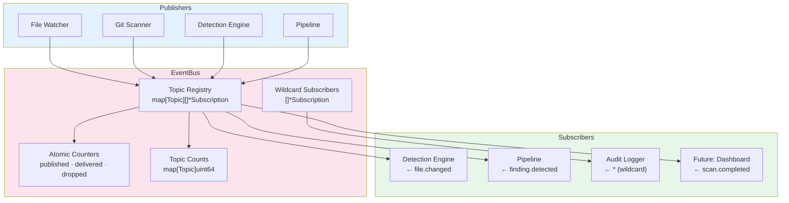
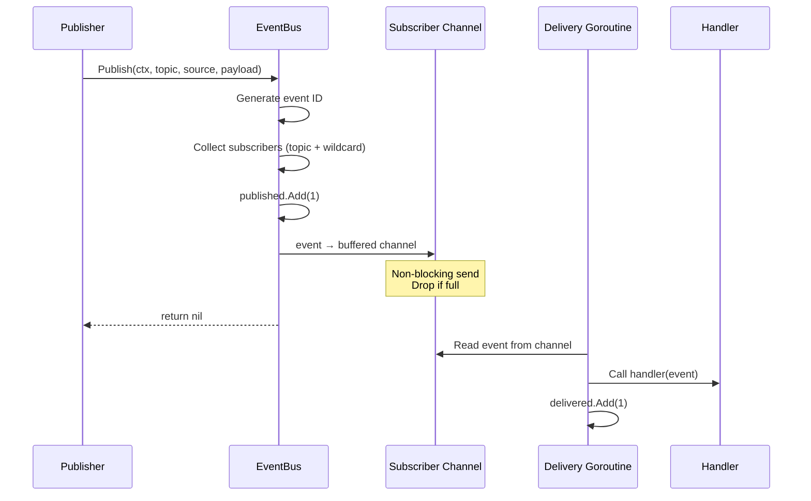
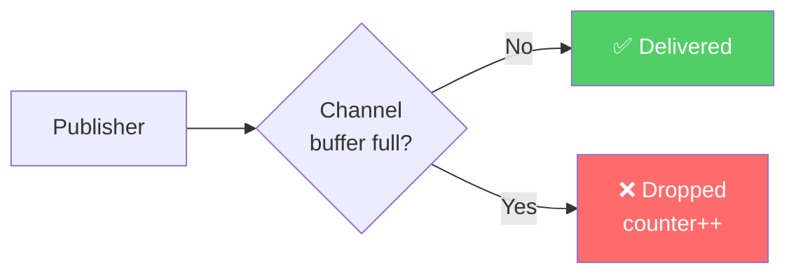
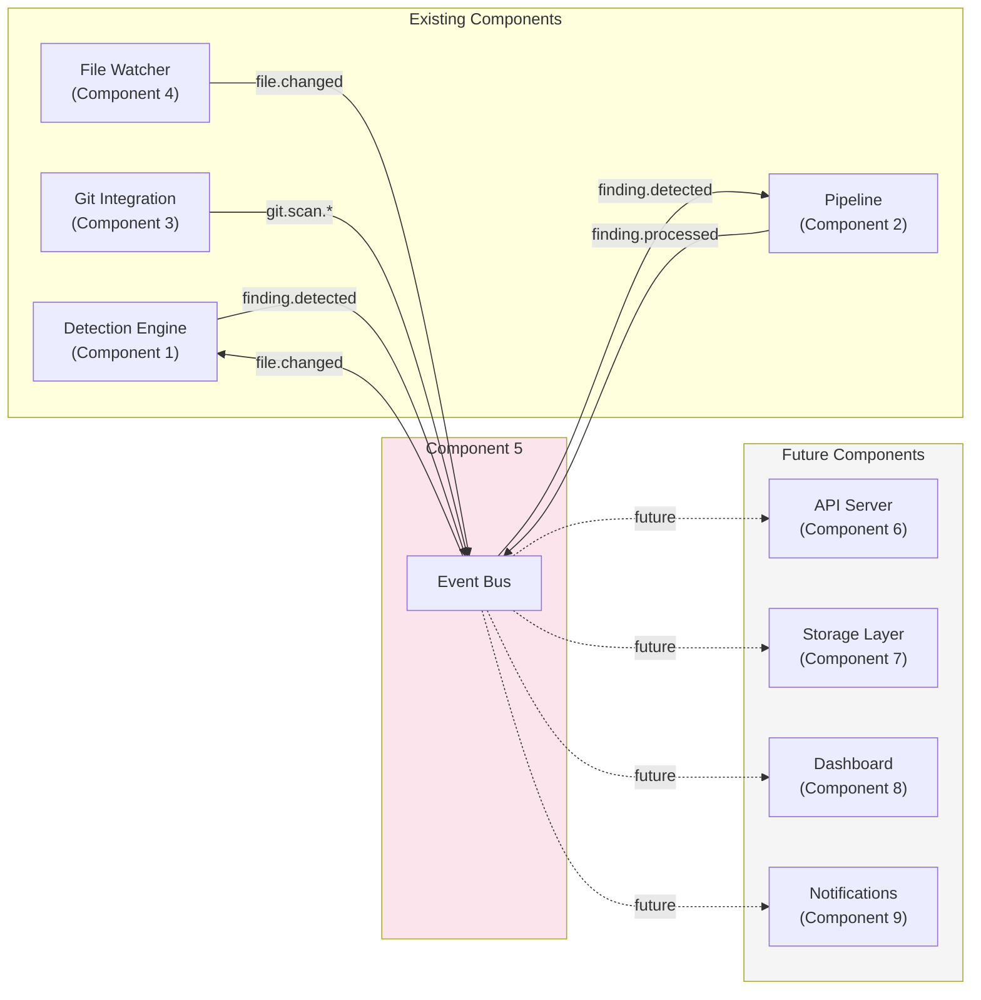

# CredVigil System Design — Component 5: Event Bus

> A focused system design document for the Event Bus component.

---

## Overview

The Event Bus is an in-process, topic-based publish/subscribe message broker that enables decoupled communication between CredVigil components. It replaces direct function calls with asynchronous event delivery, allowing components to communicate without importing or knowing about each other.

---

## Design Goals

| Goal | How Achieved |
|------|-------------|
| **Decoupled communication** | Components interact only through the bus — no direct imports |
| **Async by default** | Buffered channels with dedicated delivery goroutines |
| **Thread-safe** | RWMutex for subscriptions, atomic operations for counters |
| **Zero external dependencies** | Pure Go — channels, sync, atomic |
| **Observable** | Built-in published/delivered/dropped stats with per-topic counts |
| **Graceful shutdown** | Drain in-flight events before stopping goroutines |

---

## Architecture



---

## Data Model

### Event

```
┌─────────────────────────────────────────────┐
│ Event                                       │
├─────────────────────────────────────────────┤
│ ID        string      "evt-1710000-1"       │
│ Topic     Topic       "file.changed"        │
│ Timestamp time.Time   2026-03-14T10:00:00Z  │
│ Source    string      "watcher"             │
│ Payload   interface{} (topic-dependent)     │
└─────────────────────────────────────────────┘
```

### Topics

| Topic | Publisher | Payload Type |
|-------|----------|-------------|
| `file.changed` | Watcher | `string` (file path) |
| `scan.started` | CLI/API | `ScanRequest` |
| `scan.completed` | CLI/API | `ScanResult` |
| `finding.detected` | Engine | `Finding` |
| `finding.processed` | Pipeline | `Finding` |
| `git.scan.started` | Git Scanner | `string` (repo URL) |
| `git.scan.completed` | Git Scanner | `ScanResult` |
| `git.commit.scanned` | Git Scanner | `CommitResult` |
| `error` | Any | `error` |
| `*` (wildcard) | — | Receives all events |

### Subscription

```
┌──────────────────────────────────────┐
│ Subscription                         │
├──────────────────────────────────────┤
│ ID       string       "sub-1"       │
│ Topic    Topic        "file.changed" │
│ handler  Handler      func(Event)   │
│ ch       chan Event    [256 buffer]  │
│ done     chan struct{} (stop signal) │
│ active   atomic.Bool  true/false    │
└──────────────────────────────────────┘
     │
     └── 1 dedicated goroutine (deliverLoop)
```

---

## Event Flow



---

## Concurrency Model

### Lock Strategy

| Operation | Lock Type | Why |
|-----------|----------|-----|
| `Subscribe()` | Write lock | Modifies subscription map |
| `Unsubscribe()` | Write lock | Modifies subscription map |
| `Publish()` — read subs | Read lock | Multiple publishers can read concurrently |
| `Publish()` — update stats | Write lock | topicCounts map modification |
| `GetStats()` | Read lock | Reads internal maps |
| Counter increments | Atomic (no lock) | `published`, `delivered`, `dropped` |
| `closed` check | Atomic (no lock) | Fast-path rejection |

### Goroutine Model

```
Main goroutine
├── Publish calls run on caller's goroutine (no spawning)
├── Subscriber 1 delivery goroutine (reads ch → calls handler)
├── Subscriber 2 delivery goroutine
├── ...
└── Subscriber N delivery goroutine
```

Each subscriber = 1 goroutine + 1 buffered channel. Goroutines exit on `Unsubscribe()` or `Close()`.

---

## Backpressure Strategy



- **Buffer size**: 256 events per subscriber (configurable)
- **Drop policy**: Non-blocking send — if buffer full, event is dropped for that subscriber
- **Isolation**: One slow subscriber doesn't affect others
- **Observability**: `Stats.Dropped` counter tracks total dropped events

---

## Configuration

| Parameter | Default | Purpose |
|-----------|---------|---------|
| `BufferSize` | 256 | Channel buffer per subscriber |
| `DeliveryTimeout` | 100ms | Reserved for future timeout-based delivery |

Both have safe fallbacks — zero or negative values are corrected to defaults.

---

## Integration Points



---

## API Surface

| Method | Signature | Description |
|--------|-----------|-------------|
| `New` | `New(Config) *EventBus` | Create bus with custom config |
| `NewDefault` | `NewDefault() *EventBus` | Create bus with defaults (256 buffer, 100ms timeout) |
| `Subscribe` | `Subscribe(Topic, Handler) (*Subscription, error)` | Register a handler for a topic |
| `Unsubscribe` | `Unsubscribe(*Subscription)` | Remove a subscription |
| `Publish` | `Publish(ctx, Topic, source, payload) error` | Async event delivery |
| `PublishSync` | `PublishSync(ctx, Topic, source, payload) error` | Sync — blocks until all handlers finish |
| `Close` | `Close()` | Shutdown: stop accepting, drain, stop goroutines |
| `GetStats` | `GetStats() Stats` | Snapshot of published/delivered/dropped/topic counts |
| `IsClosed` | `IsClosed() bool` | Check if bus is shut down |
| `HasSubscribers` | `HasSubscribers(Topic) bool` | Check if topic has active subscribers |
| `SubscriberCount` | `SubscriberCount(Topic) int` | Count active subscribers (including wildcard) |
| `Topics` | `Topics() []Topic` | List topics with active subscribers |

---

## Test Coverage

**42 tests + 5 benchmarks** organized by category:

| Category | Tests | What's Verified |
|----------|-------|----------------|
| Construction & Defaults | 4 | New, NewDefault, fallback values |
| Subscribe | 4 | Normal, nil handler, closed bus, multiple subs |
| Unsubscribe | 4 | Remove, nil, idempotent, wildcard |
| Publish & Delivery | 6 | Single/multi subscriber, closed bus, cancelled ctx, ID, timestamp |
| Wildcard | 3 | All topics, dual receipt, count inclusion |
| PublishSync | 3 | Sync delivery, closed bus, multi-subscriber |
| Stats | 2 | Published count, per-topic counts |
| HasSubscribers | 2 | Present, empty |
| Topics | 1 | Active topic listing |
| Close | 3 | Marks closed, idempotent, stops delivery |
| Event Model | 1 | All fields populated with typed payload |
| Topic Constants | 1 | All 10 topic values correct |
| Concurrency | 3 | Concurrent sub+pub, concurrent unsub, pub+close |
| Integration | 3 | Watcher→engine flow, audit log, git scan chain |
| Edge Cases | 2 | No subscribers, custom topics |
| **Benchmarks** | **5** | Publish, PublishSync, Sub/Unsub, FanOut-100, Payload |

All tests pass with `-race` flag.

---

## Performance Characteristics

| Operation | Approximate Cost | Notes |
|-----------|-----------------|-------|
| Publish (1 subscriber) | ~800ns | Non-blocking channel send |
| Publish (100 subscribers) | ~15µs | Linear fan-out |
| Subscribe | ~2µs | Map insert + goroutine spawn |
| Unsubscribe | ~2µs | Map removal + channel close |
| GetStats | ~500ns | Atomic reads + map copy |

Memory: ~200 bytes (bus) + ~8KB per subscriber (buffered channel).

---

## Future Enhancements

| Enhancement | Benefit |
|-------------|---------|
| Dead letter queue | Store dropped events for retry/analysis |
| Event persistence | Write-ahead log for replay and audit |
| Priority topics | Critical findings delivered before informational events |
| Middleware/interceptors | Cross-cutting concerns (logging, tracing, metrics) |
| Circuit breaker | Disable repeatedly failing handlers |
| Event deduplication | Prevent duplicate processing of same event |
| Subscriber groups | Load-balance events across a group of handlers |

---

*Copyright 2026 CredVigil Contributors. Licensed under the Apache License, Version 2.0.*
