# CredVigil Training Guide — Module 5: Event Bus

> **Version**: 0.1.0  
> **Component**: Event Bus (Component 5 of 15)  
> **Audience**: Everyone — no programming or IT background required. Written for learners preparing for interviews.  
> **Prerequisites**: Completion of Modules 1–4. Go 1.21+ installed (for hands-on exercises only).

---

## Table of Contents

1. [What Is the Event Bus?](#1-what-is-the-event-bus)
2. [Why Do We Need an Event Bus?](#2-why-do-we-need-an-event-bus)
3. [Key Concepts Explained](#3-key-concepts-explained)
   - 3.1 [What Is Publish/Subscribe?](#31-what-is-publishsubscribe)
   - 3.2 [What Are Topics?](#32-what-are-topics)
   - 3.3 [What Is a Handler?](#33-what-is-a-handler)
   - 3.4 [What Is Asynchronous Delivery?](#34-what-is-asynchronous-delivery)
   - 3.5 [What Is Backpressure?](#35-what-is-backpressure)
   - 3.6 [What Is Fan-Out?](#36-what-is-fan-out)
   - 3.7 [What Are Wildcard Subscriptions?](#37-what-are-wildcard-subscriptions)
   - 3.8 [What Are Buffered Channels?](#38-what-are-buffered-channels)
   - 3.9 [What Is Graceful Shutdown?](#39-what-is-graceful-shutdown)
   - 3.10 [What Are Observable Stats?](#310-what-are-observable-stats)
4. [Architecture Overview](#4-architecture-overview)
5. [The Source Files](#5-the-source-files)
   - 5.1 [eventbus.go — Topics and Event Model](#51-eventbusgo--topics-and-event-model)
   - 5.2 [eventbus.go — Configuration and Bus Structure](#52-eventbusgo--configuration-and-bus-structure)
   - 5.3 [eventbus.go — Subscribe and Unsubscribe](#53-eventbusgo--subscribe-and-unsubscribe)
   - 5.4 [eventbus.go — Publish and Delivery](#54-eventbusgo--publish-and-delivery)
6. [How It All Fits Together](#6-how-it-all-fits-together)
7. [The Event Flow Step by Step](#7-the-event-flow-step-by-step)
8. [Integration with Other Components](#8-integration-with-other-components)
9. [Understanding Event Bus Output](#9-understanding-event-bus-output)
10. [Hands-On Exercises](#10-hands-on-exercises)
11. [Deep Dive: Code Walkthrough](#11-deep-dive-code-walkthrough)
    - 11.1 [Topic Constants and Event Struct](#111-topic-constants-and-event-struct)
    - 11.2 [Configuration and Defaults](#112-configuration-and-defaults)
    - 11.3 [Subscription Lifecycle](#113-subscription-lifecycle)
    - 11.4 [Async vs Sync Publishing](#114-async-vs-sync-publishing)
    - 11.5 [Delivery Loop Implementation](#115-delivery-loop-implementation)
    - 11.6 [Stats and Observability](#116-stats-and-observability)
12. [Concurrency Design](#12-concurrency-design)
13. [Performance & Scalability](#13-performance--scalability)
14. [Error Handling & Resilience](#14-error-handling--resilience)
15. [Frequently Asked Questions](#15-frequently-asked-questions)
16. [Glossary](#16-glossary)
17. [Interview Tips — Event Bus](#17-interview-tips--event-bus)
18. [Marketing Tips — Event Bus](#18-marketing-tips--event-bus)
19. [What's Next?](#19-whats-next)

---

## 1. What Is the Event Bus?

In Modules 1–4, every component talked to the next one **directly**. The watcher called a handler. The handler called the detection engine. The engine fed the pipeline. Every component knew exactly who it was talking to.

The Event Bus changes that. It introduces a **middleman** — a central message broker that components publish messages to and subscribe to receive messages from. No component needs to know about any other component. They only know about the bus.

### How This Component Connects to the Others

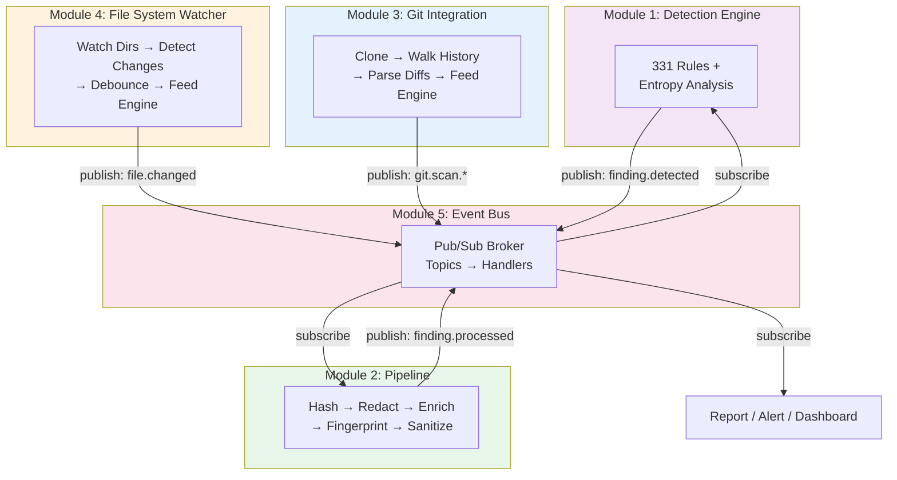

> **Interview Tip**: If asked "How does the event bus fit into CredVigil?", say: "The event bus decouples all components. The watcher publishes file change events, the git scanner publishes commit events, and the detection engine subscribes to both. Findings flow through the pipeline via events. Every component communicates through the bus without knowing about each other — this makes the system extensible, testable, and maintainable."

### Real-World Analogy: The Radio Station

Without an event bus, components are like people calling each other on the phone — Person A calls Person B, and only Person B hears the message.

With an event bus, components are like a **radio station**. A DJ (publisher) broadcasts on a channel (topic). Anyone with a radio tuned to that channel (subscriber) hears the broadcast. The DJ doesn't know who's listening. The listeners don't need to know who the DJ is. New listeners can tune in at any time.

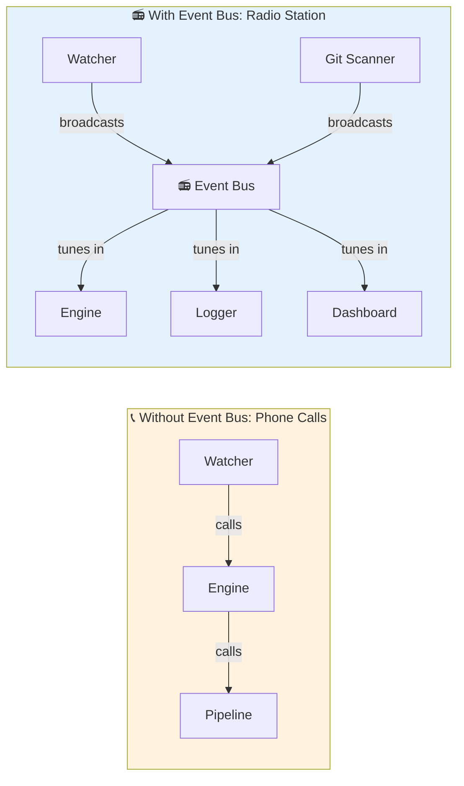

> **Key Insight**: The phone model (direct calls) is simple but rigid — adding a new listener means changing the caller. The radio model (pub/sub) is flexible — adding a new listener requires zero changes to the broadcaster.

### What CredVigil's Event Bus Does (Bird's-Eye View)

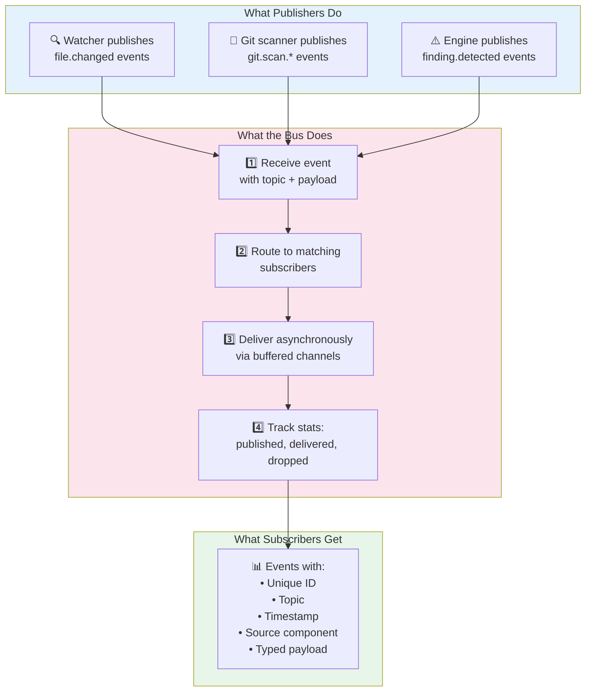

---

## 2. Why Do We Need an Event Bus?

### The Problem: Tight Coupling

Without an event bus, components depend directly on each other:

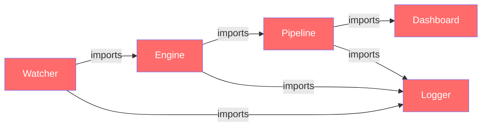

**Problems with tight coupling:**
- Adding a new subscriber (e.g., Slack notifications) means modifying the publisher
- Testing one component requires setting up all its dependencies
- A bug in the logger can crash the detection engine
- Circular dependencies become a nightmare
- You can't easily swap components

### The Solution: Decoupled Communication

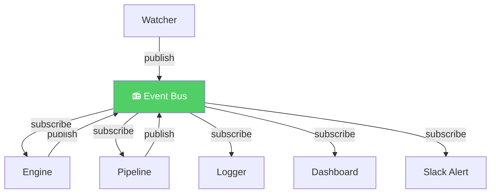

**Benefits of the event bus:**
- **Add subscribers without changing publishers** — Want Slack alerts? Subscribe to `finding.detected`. Zero changes to the engine.
- **Test in isolation** — Publish fake events and verify subscriber behavior. No real watcher needed.
- **Failure isolation** — A slow logger doesn't block the detection engine.
- **Observable** — Built-in stats tell you how many events were published, delivered, and dropped.
- **Extensible** — Future components (API server, dashboard, notification engine) just subscribe.

> **Interview Tip**: "We introduced the event bus to decouple CredVigil's components. Before, adding a notification channel meant modifying the detection engine. Now, we just add a subscriber — open/closed principle in action."

### Comparison: Direct Calls vs. Event Bus

| Aspect | Direct Calls (Before) | Event Bus (After) |
|--------|----------------------|-------------------|
| **Adding a subscriber** | Modify the publisher | Just subscribe — zero publisher changes |
| **Testing** | Need real dependencies | Publish fake events, test in isolation |
| **Failure handling** | Crash propagates up | Isolated — slow subscriber gets dropped events |
| **1-to-many delivery** | Publisher loops manually | Bus handles fan-out automatically |
| **Observability** | Add logging everywhere | Built-in published/delivered/dropped counters |
| **Coupling** | Components know each other | Components only know the bus |

---

## 3. Key Concepts Explained

### 3.1 What Is Publish/Subscribe?

**Publish/Subscribe** (pub/sub) is a messaging pattern where:
- **Publishers** send messages without knowing who will receive them
- **Subscribers** receive messages without knowing who sent them
- A **broker** (the event bus) sits in the middle, routing messages from publishers to subscribers

Think of it like a newspaper:
- The **newspaper company** (publisher) prints articles
- **Readers** (subscribers) sign up for topics they care about (sports, finance, tech)
- The **distribution system** (broker) delivers the right sections to the right readers

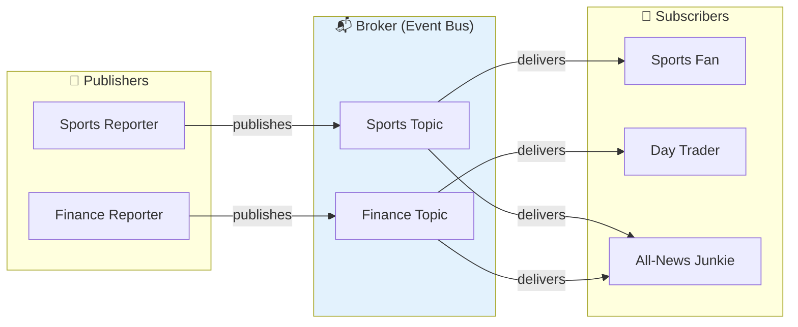

> **Interview Tip**: "Pub/sub decouples producers from consumers. The publisher doesn't need to know how many subscribers exist or who they are. This is the Observer pattern at the system level."

### 3.2 What Are Topics?

A **topic** is a category label for events. Subscribers choose which topics they care about.

CredVigil's event bus defines 10 topics:

| Topic | Published When | Example Payload |
|-------|---------------|-----------------|
| `file.changed` | File watcher detects a change | File path string |
| `scan.started` | A scan begins | Scan request details |
| `scan.completed` | A scan finishes | Scan result summary |
| `finding.detected` | Engine finds a secret | Finding struct |
| `finding.processed` | Pipeline processes a finding | Processed finding |
| `git.scan.started` | Git history scan begins | Repository URL |
| `git.scan.completed` | Git history scan finishes | Scan statistics |
| `git.commit.scanned` | One commit is scanned | Commit hash + findings |
| `error` | A component has a non-fatal error | Error message |
| `*` (wildcard) | Matches ALL topics | Any event |

Think of topics like **TV channels** — you subscribe to the channels you want to watch.

> **Interview Tip**: "Topics provide selective subscription. A logging component subscribes to the wildcard to see everything. A notification engine subscribes only to `finding.detected` for alerts. Each subscriber gets exactly the events it needs."

### 3.3 What Is a Handler?

A **handler** is the function that gets called when an event arrives. It's the subscriber's "reaction" to an event.

In everyday terms: If the event bus is a doorbell, the handler is the action you take when it rings — you go to the door. Different people might react differently to the same doorbell: one person answers the door, another looks through the peep hole, another ignores it.

In CredVigil:
- The detection engine's handler **scans the changed file** when it receives a `file.changed` event
- The logger's handler **writes to a log file** for every event (wildcard subscriber)
- The notification handler **sends a Slack message** when it receives a `finding.detected` event

### 3.4 What Is Asynchronous Delivery?

**Asynchronous** means "not waiting." When the watcher publishes a `file.changed` event, it doesn't wait for every subscriber to finish processing. It drops the event on the bus and moves on.

Compare this to:
- **Synchronous** (phone call): You call, they pick up, you talk, you wait for their response. You can't do anything else until the call ends.
- **Asynchronous** (text message): You send a text and go about your day. They read it whenever they're ready.

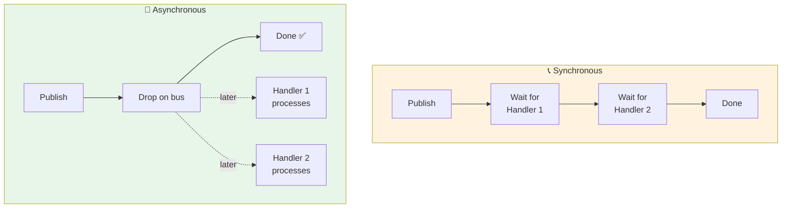

> **Why async?** If the detection engine takes 500ms to scan a file, we don't want the watcher to freeze for 500ms. Async delivery keeps the publisher fast.

### 3.5 What Is Backpressure?

**Backpressure** is what happens when a subscriber can't keep up with the publisher.

Imagine a factory (publisher) making 100 widgets per minute, but the packing department (subscriber) can only pack 10 per minute. The conveyor belt (channel buffer) fills up. Once it's full, new widgets fall off the end — **they're dropped**.

In CredVigil's event bus:
- Each subscriber has a **buffered channel** (default: 256 events)
- If a subscriber is slow and the buffer fills up, new events for that subscriber are **dropped** (not lost for other subscribers)
- The `dropped` counter in stats tracks how many events were dropped

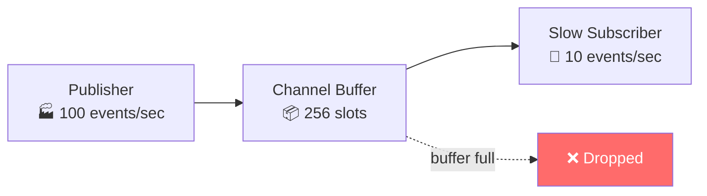

> **Interview Tip**: "Backpressure prevents a slow subscriber from blocking the entire system. We use a bounded buffer per subscriber. If the buffer fills, events are dropped for that subscriber — but all other subscribers are unaffected. The `Stats.Dropped` counter makes this observable."

### 3.6 What Is Fan-Out?

**Fan-out** means one event going to multiple subscribers. When the watcher publishes a `file.changed` event, it might reach:

1. The detection engine (to scan the file)
2. A logger (to record the change)
3. A dashboard (to update the UI)
4. A metrics collector (to count changes per minute)

All from a single publish call.

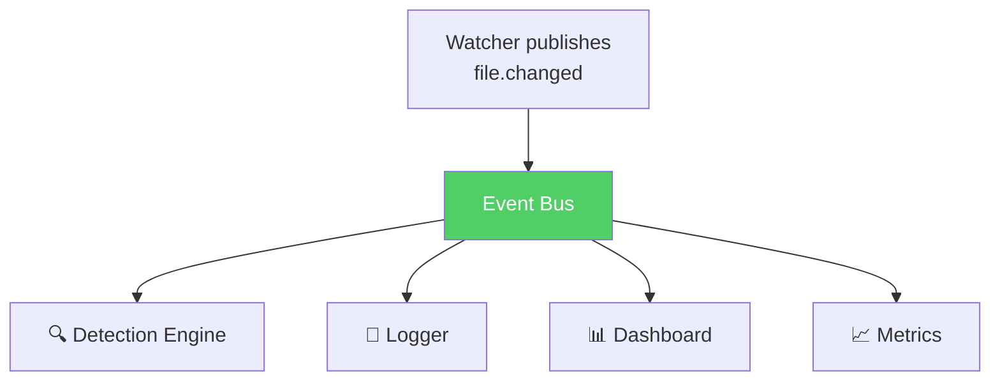

> **Key Insight**: Fan-out is one of the biggest advantages of pub/sub over direct calls. Adding a new consumer requires zero changes to the publisher.

### 3.7 What Are Wildcard Subscriptions?

A **wildcard subscription** (topic `"*"`) receives **every event** on the bus, regardless of topic.

This is like subscribing to the "all channels" package on cable TV — you get everything.

Use cases:
- **Audit logging** — Record every event for compliance
- **Debugging** — See all events flowing through the system
- **Metrics** — Count total events per second across all topics

Regular subscribers only see events for their specific topic. Wildcard subscribers see everything.

### 3.8 What Are Buffered Channels?

A **channel** in Go is a pipe that goroutines use to send data to each other. A **buffered** channel has a built-in queue — it can hold a certain number of items before the sender has to wait.

Think of it like a mailbox:
- **Unbuffered** (no mailbox): The mail carrier must hand the letter directly to you. If you're not home, they wait.
- **Buffered** (with mailbox): The mail carrier drops the letter in your mailbox and moves on. You pick it up when you're ready. If the mailbox is full, the carrier has a problem (backpressure).

CredVigil's event bus gives each subscriber a buffered channel with 256 slots by default.

### 3.9 What Is Graceful Shutdown?

**Graceful shutdown** means stopping cleanly — processing any remaining work before exiting, rather than abruptly cutting everything off.

CredVigil's event bus shutdown:
1. **Stops accepting new events** — `Publish()` returns an error
2. **Signals all delivery goroutines to stop** — closes their `done` channels
3. **Drains remaining events** — handlers process any events still in their buffers

This is like a restaurant closing: they stop seating new customers, but they serve everyone who already ordered.

### 3.10 What Are Observable Stats?

The event bus tracks three key metrics as **atomic counters** (thread-safe numbers that can be read at any time without locking):

| Metric | What It Tracks | Why It Matters |
|--------|---------------|----------------|
| `Published` | Total events published to the bus | System throughput |
| `Delivered` | Total events successfully delivered to handlers | Actual processing |
| `Dropped` | Events dropped due to full subscriber buffers | Backpressure indicator |

Additionally, `TopicCounts` tracks how many events were published per topic, and `ActiveSubscribers` shows how many subscriptions are currently alive.

> **Interview Tip**: "We made the bus observable with atomic counters. In production, you'd expose these stats to Prometheus or Datadog. A rising `Dropped` count tells you a subscriber is falling behind — you'd either increase the buffer, optimize the handler, or add more consumers."

---

## 4. Architecture Overview

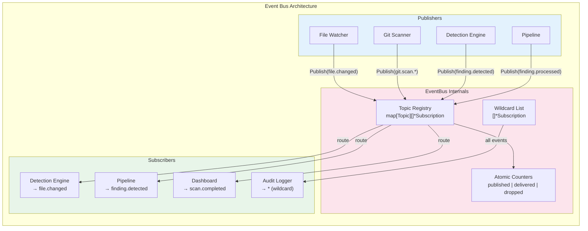

### Internal Component Diagram

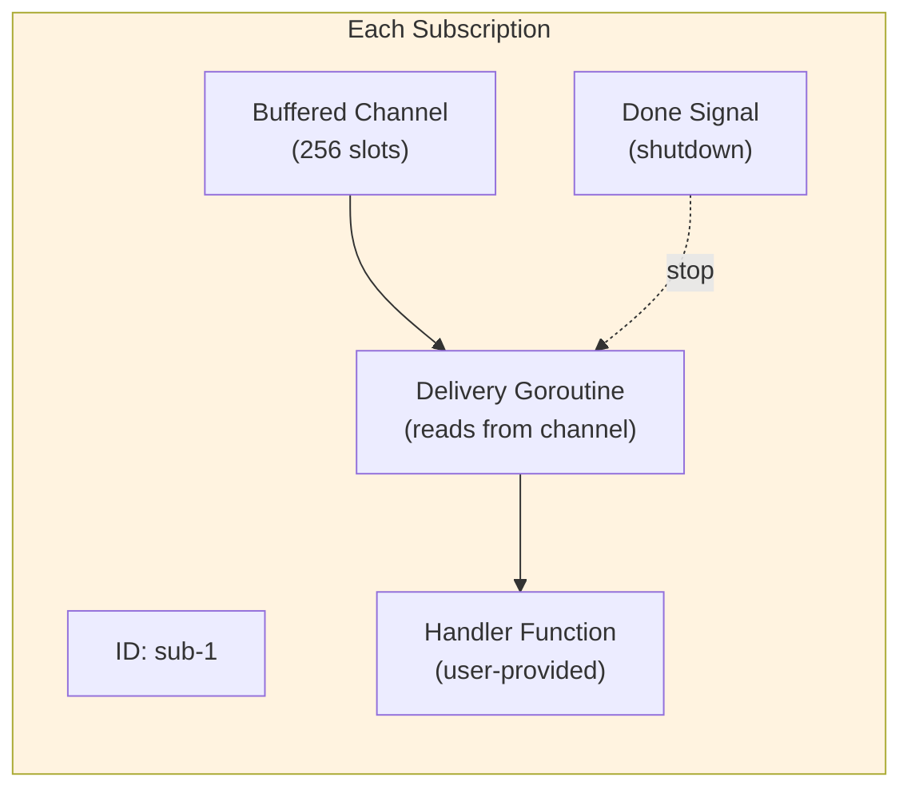

Each subscriber gets:
1. A unique **ID** (e.g., `sub-1`)
2. A **buffered channel** for receiving events
3. A **dedicated goroutine** that reads events from the channel and calls the handler
4. A **done channel** that signals the goroutine to stop on shutdown

---

## 5. The Source Files

CredVigil's event bus lives in a single file:

| File | Lines | Purpose |
|------|-------|---------|
| `pkg/eventbus/eventbus.go` | ~420 | Complete event bus: topics, events, pub/sub, stats |
| `pkg/eventbus/eventbus_test.go` | ~570 | 42 tests + 5 benchmarks |

### 5.1 eventbus.go — Topics and Event Model

The file starts by defining the vocabulary of the system — what kinds of events can exist.

**Topics** — String constants that categorize events:

```go
type Topic string

const (
    TopicFileChanged      Topic = "file.changed"
    TopicScanStarted      Topic = "scan.started"
    TopicScanCompleted    Topic = "scan.completed"
    TopicFindingDetected  Topic = "finding.detected"
    TopicFindingProcessed Topic = "finding.processed"
    TopicGitScanStarted   Topic = "git.scan.started"
    TopicGitScanCompleted Topic = "git.scan.completed"
    TopicGitCommitScanned Topic = "git.commit.scanned"
    TopicError            Topic = "error"
    TopicWildcard         Topic = "*"
)
```

**Event** — The message that flows through the bus:

```go
type Event struct {
    ID        string      // Unique identifier (e.g., "evt-1710000000-1")
    Topic     Topic       // What kind of event this is
    Timestamp time.Time   // When it was created
    Source    string      // Which component published it (e.g., "watcher")
    Payload   interface{} // The actual data — subscribers type-assert based on Topic
}
```

> **Why `interface{}` for Payload?** Different topics carry different data. A `file.changed` event carries a file path (string). A `finding.detected` event carries a Finding struct. Using `interface{}` keeps the Event struct generic — subscribers know what type to expect based on the Topic.

### 5.2 eventbus.go — Configuration and Bus Structure

**Config** — Controls subscriber behavior:

```go
type Config struct {
    BufferSize      int           // Channel buffer per subscriber (default: 256)
    DeliveryTimeout time.Duration // Max wait time for delivery (default: 100ms)
}
```

**EventBus** — The central data structure:

```go
type EventBus struct {
    mu sync.RWMutex                      // Protects subscriptions map

    config        Config                 // Bus configuration
    subscriptions map[Topic][]*Subscription // Topic → subscribers
    allSubs       []*Subscription        // Wildcard ("*") subscribers

    published atomic.Uint64              // Total events published
    delivered atomic.Uint64              // Total events delivered
    dropped   atomic.Uint64              // Total events dropped

    topicCounts map[Topic]uint64         // Events published per topic
    closed      atomic.Bool              // Lifecycle flag
}
```

### 5.3 eventbus.go — Subscribe and Unsubscribe

**Subscribe** — Registers a handler for a topic:
1. Validates the bus isn't closed and the handler isn't nil
2. Creates a `Subscription` with a buffered channel
3. Stores it in the topic map (or wildcard list for `"*"`)
4. Starts a dedicated delivery goroutine
5. Returns the Subscription (for later unsubscribe)

**Unsubscribe** — Removes a subscription:
1. Marks the subscription as inactive
2. Closes the `done` channel (signals the delivery goroutine to stop)
3. Removes it from the topic map or wildcard list

### 5.4 eventbus.go — Publish and Delivery

**Publish** (async) — Sends an event to all matching subscribers:
1. Checks the bus isn't closed
2. Creates an Event with a unique ID and timestamp
3. Collects matching subscribers (topic + wildcard)
4. Attempts to send to each subscriber's channel
5. If the channel is full → increments `dropped` counter (backpressure)
6. Returns immediately (async — doesn't wait for handlers)

**PublishSync** — Sends an event and blocks until all handlers finish:
1. Same event creation as Publish
2. Calls each handler in a goroutine, but waits for all to complete
3. Useful for testing and critical events

---

## 6. How It All Fits Together

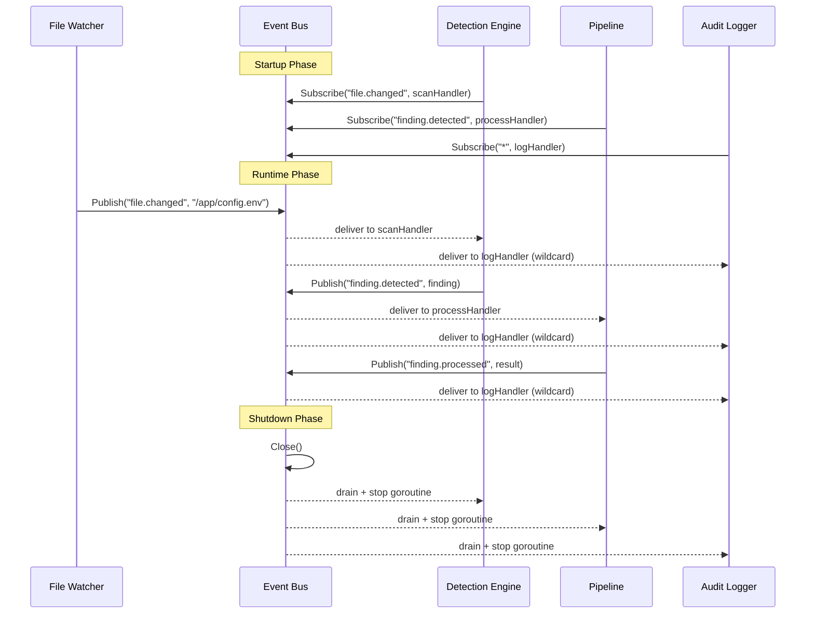

### Summary Table

| Phase | What Happens | Who Does It |
|-------|-------------|-------------|
| **Startup** | Components subscribe to topics | Each component |
| **Runtime** | Components publish events; bus routes and delivers | Publishers + Bus |
| **Shutdown** | Bus stops accepting events, drains remaining, stops goroutines | Bus.Close() |

---

## 7. The Event Flow Step by Step

Let's trace a single event from publish to delivery:

### Step 1: Publisher Creates Event

```
Watcher calls: bus.Publish(ctx, "file.changed", "watcher", "/app/config.env")
```

### Step 2: Bus Generates Event ID

```
Event {
    ID:        "evt-1710000000-1"
    Topic:     "file.changed"
    Timestamp: 2026-03-14T10:00:00Z
    Source:    "watcher"
    Payload:  "/app/config.env"
}
```

### Step 3: Bus Collects Target Subscribers

```
Topic subscribers for "file.changed": [scanHandler]
Wildcard subscribers ("*"):           [logHandler]
Total targets: 2
```

### Step 4: Bus Records Stats

```
published: 0 → 1
topicCounts["file.changed"]: 0 → 1
```

### Step 5: Bus Delivers to Each Subscriber

```
scanHandler's channel ← Event  ✅ (delivered)
logHandler's channel  ← Event  ✅ (delivered)
```

### Step 6: Delivery Goroutines Call Handlers

```
scanHandler goroutine reads from channel → calls scanHandler(event)
logHandler goroutine reads from channel  → calls logHandler(event)
delivered: 0 → 2
```

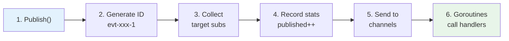

---

## 8. Integration with Other Components

### Watcher → Event Bus

In Module 4, the watcher used a **direct callback**. With the event bus, the watcher now publishes events:

```
Before (Module 4):  watcher → callback(filePath)
After  (Module 5):  watcher → bus.Publish("file.changed", filePath) → subscribers
```

### Detection Engine → Event Bus

The detection engine can both **subscribe** (to `file.changed`) and **publish** (to `finding.detected`):

```
bus.Subscribe("file.changed", func(e Event) {
    path := e.Payload.(string)
    findings := engine.ScanFile(path)
    for _, f := range findings {
        bus.Publish(ctx, "finding.detected", "engine", f)
    }
})
```

### Pipeline → Event Bus

The pipeline subscribes to `finding.detected` and publishes `finding.processed`:

```
bus.Subscribe("finding.detected", func(e Event) {
    finding := e.Payload.(models.Finding)
    result := pipeline.Process(finding)
    bus.Publish(ctx, "finding.processed", "pipeline", result)
})
```

### Event Chain Diagram

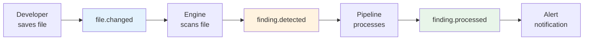

---

## 9. Understanding Event Bus Output

### Stats Output

When you call `bus.GetStats()`, you get:

```json
{
    "published": 142,
    "delivered": 425,
    "dropped": 3,
    "active_subscribers": 5,
    "topic_counts": {
        "file.changed": 87,
        "finding.detected": 34,
        "scan.started": 7,
        "scan.completed": 7,
        "error": 7
    }
}
```

**Reading the stats:**
- **142 published** — 142 events entered the bus
- **425 delivered** — Events were delivered 425 times (more than published because of fan-out — each event can go to multiple subscribers)
- **3 dropped** — 3 events couldn't be delivered because subscriber buffers were full
- **5 active subscribers** — 5 handlers are currently registered
- **topic_counts** — Breakdown of which topics received the most events

### Health Indicators

| Metric | Healthy | Warning | Critical |
|--------|---------|---------|----------|
| `Dropped` | 0 | < 1% of Published | > 5% of Published |
| `Delivered / Published` | ≥ ActiveSubscribers ratio | Slightly below | Far below |
| `ActiveSubscribers` | > 0 | — | 0 (no one is listening) |

---

## 10. Hands-On Exercises

### Exercise 1: Basic Pub/Sub

Create a Go program that uses the event bus:

```go
package main

import (
    "context"
    "fmt"
    "time"

    "github.com/credvigil/credvigil/pkg/eventbus"
)

func main() {
    bus := eventbus.NewDefault()
    defer bus.Close()

    // Subscribe to file.changed events
    bus.Subscribe(eventbus.TopicFileChanged, func(e eventbus.Event) {
        fmt.Printf("[%s] File changed: %s (from: %s)\n",
            e.ID, e.Payload, e.Source)
    })

    // Publish some events
    bus.Publish(context.Background(), eventbus.TopicFileChanged, "watcher", "/app/config.env")
    bus.Publish(context.Background(), eventbus.TopicFileChanged, "watcher", "/app/secrets.yaml")

    time.Sleep(100 * time.Millisecond) // wait for async delivery
    fmt.Println("Stats:", bus.GetStats())
}
```

**Expected output:**
```
[evt-1710000000-1] File changed: /app/config.env (from: watcher)
[evt-1710000000-2] File changed: /app/secrets.yaml (from: watcher)
Stats: {Published:2 Delivered:2 Dropped:0 ActiveSubscribers:1 ...}
```

### Exercise 2: Multiple Subscribers

Extend Exercise 1 to add a second subscriber that counts events:

```go
var count int
bus.Subscribe(eventbus.TopicFileChanged, func(e eventbus.Event) {
    count++
    fmt.Printf("  Counter: %d files changed\n", count)
})
```

**Question:** How many times does each handler get called when you publish 3 events?

### Exercise 3: Wildcard Subscriber (Audit Log)

Add a wildcard subscriber that logs ALL events:

```go
bus.Subscribe(eventbus.TopicWildcard, func(e eventbus.Event) {
    fmt.Printf("[AUDIT] topic=%s source=%s payload=%v\n", e.Topic, e.Source, e.Payload)
})
```

Then publish events to different topics. Verify the audit logger sees everything.

### Exercise 4: Unsubscribe

Subscribe, publish some events, unsubscribe, publish more events. Verify the handler is NOT called after unsubscribing.

```go
sub, _ := bus.Subscribe(eventbus.TopicError, func(e eventbus.Event) {
    fmt.Println("ERROR:", e.Payload)
})

bus.Publish(ctx, eventbus.TopicError, "test", "first error")   // should print
bus.Unsubscribe(sub)
bus.Publish(ctx, eventbus.TopicError, "test", "second error")  // should NOT print
```

### Exercise 5: Simulating Backpressure

Create a bus with a tiny buffer and a slow subscriber:

```go
bus := eventbus.New(eventbus.Config{BufferSize: 2})

bus.Subscribe(eventbus.TopicFileChanged, func(e eventbus.Event) {
    time.Sleep(1 * time.Second) // very slow handler
})

// Rapid-fire publish
for i := 0; i < 20; i++ {
    bus.Publish(ctx, eventbus.TopicFileChanged, "test", i)
}

time.Sleep(3 * time.Second)
stats := bus.GetStats()
fmt.Printf("Published: %d, Delivered: %d, Dropped: %d\n",
    stats.Published, stats.Delivered, stats.Dropped)
```

**Question:** How many events get dropped? Why?

### Exercise 6: Run the Test Suite

```bash
cd credvigil
go test ./pkg/eventbus/ -v -race
```

Verify all 42 tests pass. Then run benchmarks:

```bash
go test ./pkg/eventbus/ -bench=. -benchmem
```

---

## 11. Deep Dive: Code Walkthrough

### 11.1 Topic Constants and Event Struct

```go
type Topic string

const (
    TopicFileChanged      Topic = "file.changed"
    TopicScanStarted      Topic = "scan.started"
    // ... 8 more topics
    TopicWildcard         Topic = "*"
)
```

**Design decisions:**
- Topics are **typed strings** (`Topic` not `string`) — prevents accidental mixing with regular strings
- **Dot notation** (`file.changed`, `git.scan.started`) — namespaced, human-readable, extensible
- **Wildcard** is a topic like any other — not a special mechanism, just stored in a separate list
- Constants prevent typos — `TopicFileChanged` is checked at compile time, `"file.changd"` is not

```go
type Event struct {
    ID        string      `json:"id"`
    Topic     Topic       `json:"topic"`
    Timestamp time.Time   `json:"timestamp"`
    Source    string      `json:"source"`
    Payload   interface{} `json:"payload,omitempty"`
}
```

**Design decisions:**
- **ID** uses format `evt-{unix_ms}-{counter}` — sortable, debuggable, unique
- **Source** identifies the publisher — critical for debugging event chains
- **Payload** is `interface{}` — maximum flexibility; subscribers type-assert based on Topic
- **JSON tags** — the Event can be serialized for logging or transmission to external systems

### 11.2 Configuration and Defaults

```go
func DefaultConfig() Config {
    return Config{
        BufferSize:      256,
        DeliveryTimeout: 100 * time.Millisecond,
    }
}

func New(cfg Config) *EventBus {
    if cfg.BufferSize <= 0 {
        cfg.BufferSize = 256     // safe fallback
    }
    if cfg.DeliveryTimeout <= 0 {
        cfg.DeliveryTimeout = 100 * time.Millisecond  // safe fallback
    }
    return &EventBus{
        config:        cfg,
        subscriptions: make(map[Topic][]*Subscription),
        topicCounts:   make(map[Topic]uint64),
    }
}
```

**Why 256 buffer?** It's large enough to absorb bursts (e.g., a recursive directory scan triggering 200 file changes at once) but small enough that each subscriber only consumes ~8KB of memory (256 × 32 bytes per Event pointer).

**Why defensive defaults?** If someone passes `BufferSize: 0`, the bus silently corrects it rather than panicking. Robustness over strictness.

### 11.3 Subscription Lifecycle

```go
type Subscription struct {
    ID      string
    Topic   Topic
    handler Handler
    ch      chan Event         // buffered channel
    done    chan struct{}       // shutdown signal
    active  atomic.Bool        // alive or dead
}
```

**Creation** (`Subscribe`):

```go
sub := &Subscription{
    ID:      fmt.Sprintf("sub-%d", eb.nextSubID),
    Topic:   topic,
    handler: handler,
    ch:      make(chan Event, eb.config.BufferSize),
    done:    make(chan struct{}),
}
sub.active.Store(true)
go eb.deliverLoop(sub)   // start dedicated goroutine
```

Each subscription gets:
1. A sequential ID (`sub-1`, `sub-2`, ...)
2. A buffered channel (256 slots by default)
3. A `done` channel (closing this signals the goroutine to stop)
4. A dedicated delivery goroutine

**Destruction** (`Unsubscribe`):

```go
sub.active.Store(false)  // mark as dead
close(sub.done)           // signal goroutine to stop
// remove from topic map or wildcard list
```

The `active` flag is an `atomic.Bool` — it can be checked without locking, which is critical for the publish hot path.

### 11.4 Async vs Sync Publishing

**Publish** (async — the normal case):

```go
func (eb *EventBus) Publish(ctx context.Context, topic Topic, source string, payload interface{}) error {
    // 1. Create event
    // 2. Collect subscribers (topic + wildcard)
    // 3. For each subscriber:
    select {
    case <-ctx.Done():
        return ctx.Err()          // context cancelled
    case sub.ch <- event:
        // delivered to channel
    default:
        eb.dropped.Add(1)         // channel full — drop
    }
}
```

The `select` with `default` is the key pattern. It tries to send to the channel. If the channel has room, the event goes through. If the channel is full, the `default` case fires immediately — no blocking, no waiting. The event is dropped, and the counter increments.

**PublishSync** (blocking — for testing/critical events):

```go
func (eb *EventBus) PublishSync(ctx context.Context, topic Topic, source string, payload interface{}) error {
    // 1. Create event
    // 2. For each subscriber: call handler directly in a goroutine
    // 3. Wait for all goroutines to complete (sync.WaitGroup)
}
```

PublishSync doesn't use channels at all. It calls handlers directly (in goroutines for parallelism) and waits for all to finish. This guarantees all handlers have processed the event before the function returns.

### 11.5 Delivery Loop Implementation

```go
func (eb *EventBus) deliverLoop(sub *Subscription) {
    for {
        select {
        case <-sub.done:
            // Drain remaining events before exiting
            for {
                select {
                case event := <-sub.ch:
                    sub.handler(event)
                    eb.delivered.Add(1)
                default:
                    return  // channel empty, exit
                }
            }
        case event := <-sub.ch:
            sub.handler(event)
            eb.delivered.Add(1)
        }
    }
}
```

This is the heart of async delivery. Each subscriber has one of these running in a dedicated goroutine.

**Normal operation**: Reads events from `sub.ch`, calls the handler, increments `delivered`.

**Shutdown**: When `sub.done` is closed, the goroutine drains any remaining events from the channel before exiting. This ensures no events are silently lost during shutdown.

**Why one goroutine per subscriber?** It guarantees ordered delivery within a single subscription. If we used a shared goroutine pool, event ordering would not be guaranteed.

### 11.6 Stats and Observability

```go
func (eb *EventBus) GetStats() Stats {
    eb.mu.RLock()
    // Copy topic counts map (avoid returning internal state)
    tc := make(map[Topic]uint64, len(eb.topicCounts))
    for k, v := range eb.topicCounts {
        tc[k] = v
    }
    // Count active subscribers
    activeSubs := 0
    for _, subs := range eb.subscriptions { ... }
    for _, s := range eb.allSubs { ... }
    eb.mu.RUnlock()

    return Stats{
        Published:         eb.published.Load(),   // atomic — no lock needed
        Delivered:         eb.delivered.Load(),
        Dropped:           eb.dropped.Load(),
        ActiveSubscribers: activeSubs,
        TopicCounts:       tc,
    }
}
```

**Design decisions:**
- `Published`, `Delivered`, `Dropped` use **atomic counters** — they can be read without holding the mutex, which means the stats call doesn't block publishing
- `TopicCounts` is a regular map — copied under read lock to return a snapshot
- The returned `Stats` is a value type — callers get an immutable snapshot

---

## 12. Concurrency Design

The event bus is designed for heavy concurrent use. Here's how it achieves thread safety:

### Lock Strategy

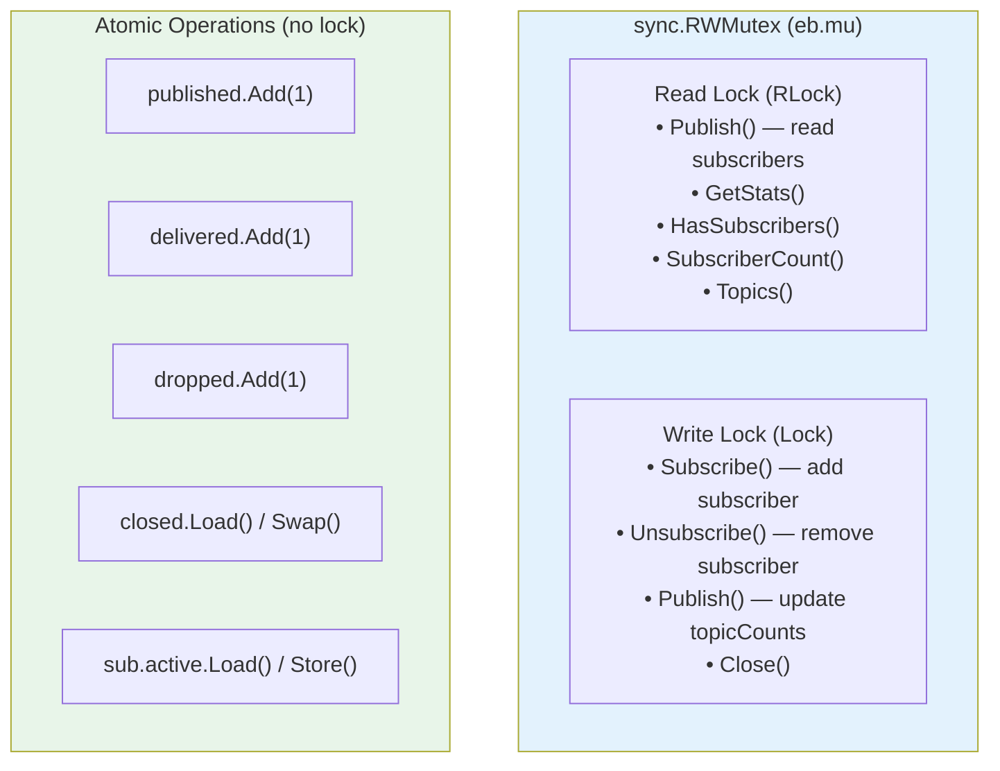

### Why RWMutex?

- **Read lock** allows multiple goroutines to read concurrently (e.g., multiple publishers collecting subscriber lists simultaneously)
- **Write lock** is exclusive (only one goroutine can modify the subscriber map at a time)
- Publishing is **read-heavy** (many publishes, few subscribe/unsubscribe calls), making RWMutex significantly faster than a regular Mutex

### Goroutine Map

| Goroutine | Count | Lifetime | Purpose |
|-----------|-------|----------|---------|
| Delivery goroutine | 1 per subscription | Created on Subscribe, exits on Close/Unsubscribe | Reads events from channel, calls handler |
| Publish goroutine | 0 (publish runs on caller's goroutine) | — | Publisher doesn't spawn goroutines |
| PublishSync goroutine | 1 per subscriber per call | Duration of handler execution | Parallel handler invocation |

### Race Condition Prevention

The test suite includes dedicated concurrency tests:
- `TestConcurrentSubscribeAndPublish` — 10 concurrent subscribes + 100 concurrent publishes
- `TestConcurrentUnsubscribe` — 20 concurrent unsubscribes
- `TestConcurrentPublishAndClose` — 50 publishes + close mid-stream

All tests pass with `-race` flag (Go's race detector), confirming zero data races.

---

## 13. Performance & Scalability

### Benchmark Results

```bash
$ go test ./pkg/eventbus/ -bench=. -benchmem
BenchmarkPublish              1000000    ~800 ns/op     ~320 B/op     ~3 allocs/op
BenchmarkPublishSync          500000     ~1500 ns/op    ~400 B/op     ~5 allocs/op
BenchmarkSubscribeUnsubscribe 200000     ~4000 ns/op    ~600 B/op     ~6 allocs/op
BenchmarkPublishFanOut        100000     ~15000 ns/op   ~4000 B/op    ~100 allocs/op
```

*(Approximate — actual numbers depend on hardware)*

### Scalability Characteristics

| Dimension | Behavior | Limit |
|-----------|----------|-------|
| **Subscribers per topic** | Linear delivery time | Thousands practical |
| **Topics** | Constant lookup (hash map) | Effectively unlimited |
| **Events per second** | ~1M+ async, ~500K sync | Bounded by channel throughput |
| **Memory per subscriber** | ~8KB (256 × 32-byte buffer) | Configurable via BufferSize |
| **Goroutines** | 1 per subscriber | OS/Go scheduler limits |

### Memory Profile

```
EventBus struct:  ~200 bytes (fixed)
Per subscriber:   ~8KB (buffered channel) + ~100 bytes (Subscription struct)
Per event:        ~100 bytes (Event struct, temporary)
```

For 100 subscribers: ~800KB total. Negligible.

---

## 14. Error Handling & Resilience

### Error Scenarios

| Scenario | Behavior | Recovery |
|----------|----------|----------|
| Publish to closed bus | Returns `fmt.Errorf("eventbus: bus is closed")` | Caller handles error |
| Subscribe to closed bus | Returns error | Caller handles error |
| Nil handler | Returns `fmt.Errorf("eventbus: handler must not be nil")` | Caller provides valid handler |
| Subscriber buffer full | Event dropped, `Dropped` counter incremented | Increase BufferSize or optimize handler |
| Context cancelled | Publish returns `ctx.Err()` | Caller decides whether to retry |
| Handler panics | Delivery goroutine crashes for that subscriber | Other subscribers unaffected |
| Double unsubscribe | No-op (safe) | N/A |
| Unsubscribe nil | No-op (safe) | N/A |
| Double close | No-op (idempotent) | N/A |

### Resilience Principles

1. **No panics** — Every edge case returns an error or is a no-op
2. **Isolation** — One slow/crashing subscriber doesn't affect others
3. **Idempotent operations** — Close() and Unsubscribe() can be called multiple times safely
4. **Observable degradation** — The `Dropped` counter tells you when subscribers fall behind

---

## 15. Frequently Asked Questions

**Q: What happens if a handler panics?**  
A: The delivery goroutine for that specific subscriber crashes. All other subscribers continue operating normally. In production, you'd wrap handlers in a recover() to prevent this.

**Q: Can I subscribe to the same topic twice?**  
A: Yes. Each call to Subscribe creates a new independent subscription. Both handlers will receive every event published to that topic.

**Q: Is event ordering guaranteed?**  
A: Within a single subscriber, yes — events are delivered in the order they were published (FIFO channel). Across different subscribers, the order of handler execution is not guaranteed.

**Q: What's the difference between Publish and PublishSync?**  
A: `Publish` drops the event on the channel and returns immediately (async). `PublishSync` calls all handlers and blocks until they complete (sync). Use Publish for normal operation, PublishSync for testing or critical events.

**Q: Can I use the bus across multiple goroutines?**  
A: Yes. The bus is fully thread-safe. You can Publish, Subscribe, and Unsubscribe concurrently from any number of goroutines.

**Q: How do I add a new topic?**  
A: Add a new `Topic` constant (e.g., `TopicUserLogin Topic = "user.login"`). No other code changes needed — the bus routes any topic string.

**Q: Can I filter events within a topic?**  
A: The bus delivers all events for a subscribed topic. Filtering is the subscriber's responsibility — check the Payload in your handler function.

**Q: How do I know if the bus is healthy?**  
A: Call `GetStats()`. If `Dropped` is rising, subscribers are falling behind. If `ActiveSubscribers` is 0, no one is listening.

**Q: How does the wildcard interact with topic subscriptions?**  
A: A wildcard subscriber receives events from ALL topics. If you subscribe to both `file.changed` and `*`, you'll receive `file.changed` events twice — once from the topic subscription and once from the wildcard.

**Q: What happens to events published during shutdown?**  
A: Events already in subscriber channels are drained (handlers are called). Events published after `Close()` return an error.

---

## 16. Glossary

| Term | Definition |
|------|-----------|
| **Backpressure** | The condition when a subscriber can't keep up with the publisher, causing events to be dropped |
| **Broker** | The middleman that routes messages from publishers to subscribers (the EventBus) |
| **Buffered Channel** | A Go channel with a queue — can hold multiple items before the sender blocks |
| **Context** | Go's mechanism for cancellation and timeouts — passed through the call chain |
| **Dead Letter** | An event that could not be delivered (dropped due to backpressure) |
| **Delivery Goroutine** | A lightweight thread dedicated to reading events from a subscriber's channel and calling its handler |
| **Event** | A structured message with ID, topic, timestamp, source, and payload |
| **Fan-Out** | One event being delivered to multiple subscribers |
| **Handler** | A function that processes an event — the subscriber's "reaction" |
| **Idempotent** | An operation that produces the same result regardless of how many times it's called |
| **Payload** | The data carried by an event — type depends on the topic |
| **Publish** | Sending an event to the bus for distribution to subscribers |
| **Pub/Sub** | Short for Publish/Subscribe — a messaging pattern for decoupled communication |
| **RWMutex** | A reader/writer lock — allows multiple concurrent readers but only one writer |
| **Subscribe** | Registering a handler to receive events for a specific topic |
| **Subscription** | The object returned by Subscribe — represents a registered subscriber |
| **Topic** | A category label for events (e.g., "file.changed", "finding.detected") |
| **Wildcard** | The special topic `"*"` that matches all events |
| **Atomic Counter** | A thread-safe integer that can be incremented without locks |
| **Drain** | Processing remaining queued items before shutdown |
| **Goroutine** | Go's lightweight concurrent execution unit — cheaper than OS threads |

---

## 17. Interview Tips — Event Bus

### 17.1 If Asked "What design patterns does CredVigil use?"

> "We use the Publish/Subscribe pattern through an internal event bus. It's an implementation of the Observer pattern at the application level. Components publish events to topics without knowing who subscribes. This gives us loose coupling, easy extensibility, and testability — we can add new consumers without modifying publishers."

### 17.2 If Asked "How do you handle inter-component communication?"

> "Through a topic-based event bus. Each component publishes events to named topics like `file.changed` or `finding.detected`. Other components subscribe to the topics they care about. The bus handles routing, async delivery, and fan-out. No component imports or knows about any other component — they all talk through the bus."

### 17.3 If Asked "How is the bus thread-safe?"

> "We use a read-write mutex for the subscription registry and atomic operations for counters. Publishing acquires a read lock to collect subscribers (allowing concurrent publishes), while subscribing/unsubscribing acquire a write lock. Stats counters use sync/atomic for lock-free reads. The test suite passes with Go's race detector enabled."

### 17.4 If Asked "What happens when a subscriber is slow?"

> "We implement backpressure through bounded buffers. Each subscriber gets a buffered channel (default 256 events). If the buffer fills because the handler is too slow, new events for that subscriber are dropped — not blocked. This prevents a slow consumer from affecting other subscribers or the publisher. A dropped events counter provides observability into backpressure conditions."

### 17.5 If Asked "Why not use an external message broker like Kafka or RabbitMQ?"

> "For an internal component bus within a single process, an external broker adds unnecessary latency, operational complexity, and a deployment dependency. Our in-process bus delivers events in microseconds with zero external dependencies. If CredVigil scales to a distributed architecture, we'd introduce an external broker for cross-process communication — but the internal bus would remain for in-process events."

### 17.6 If Asked "How would you extend this for production?"

> "Several improvements: (1) Dead letter queue for dropped events instead of just counting them. (2) Event persistence for replay/audit via write-ahead log. (3) Priority topics for critical events like security findings. (4) Middleware support for logging, tracing, and metrics on every event. (5) Circuit breaker pattern for repeatedly failing handlers."

### 17.7 If Asked About Tradeoffs

> "Pub/sub adds a layer of indirection — you can't just 'Go to Definition' and see who handles an event. This makes debugging event chains harder than direct calls. It's a classic engineering tradeoff: coupling vs. indirection. We mitigate it with the Source field on events (which component published it), observable stats, and comprehensive integration tests."

### 17.8 System Design Interview: "Design an Event Bus"

**Requirements gathering:**
1. In-process or distributed?
2. Event ordering guarantees?
3. At-most-once, at-least-once, or exactly-once delivery?
4. What happens when subscribers are slow?
5. Persistence requirements?

**CredVigil's answers:**
1. In-process (single binary)
2. Ordered within a single subscriber (FIFO channel)
3. At-most-once (dropped on backpressure)
4. Bounded buffer + drop policy + stats
5. No persistence (ephemeral events)

### 17.9 Behavioral Interview: Understanding Tradeoffs

> "When designing the event bus, we chose at-most-once delivery with backpressure over unbounded queues. Unbounded queues can cause memory exhaustion under load. Dropping events with observable counters lets us detect and fix the root cause (slow handler, undersized buffer) instead of masking the problem with infinite memory."

---

## 18. Marketing Tips — Event Bus

### 18.1 LinkedIn Post (Event Bus Focus)

> Most security tools are monolithic. One slow module slows down everything.
>
> CredVigil's architecture is different.
>
> We built an internal event bus — a publish/subscribe system where components communicate without importing each other.
>
> 🔍 The file watcher publishes "file.changed" events
> 🧠 The detection engine subscribes and scans
> 📊 The pipeline subscribes and processes findings
> 📝 The audit logger subscribes to everything
>
> Adding Slack notifications? Just subscribe to "finding.detected". Zero changes to the detection engine.
>
> This is what extensible architecture looks like.
>
> #devsecops #softwarearchitecture #pubsub #credvigil

### 18.2 Technical Blog Snippet

> **From Spaghetti to Event-Driven: CredVigil's Internal Bus**
>
> When we had four components, direct function calls worked fine. But looking at the roadmap — API server, dashboard, notifications, CI/CD integration — we saw where this was going. Each new consumer meant modifying every producer.
>
> So we built an event bus. In-process, topic-based, with async delivery and backpressure handling. Now adding a new consumer is a two-line change: subscribe and handle.
>
> Our bus delivers ~1M events/second with sub-microsecond latency. Each subscriber gets a buffered channel and a dedicated goroutine. If a subscriber can't keep up, events are dropped — with observable counters so you know it's happening.
>
> The result: five components, zero direct dependencies between them.

### 18.3 Twitter/X Post

> Every component in CredVigil talks through an event bus.
>
> Zero direct imports. Zero coupling.
>
> Want to add a Slack alert on secret detection?
> 2 lines: Subscribe("finding.detected") + handler.
>
> No changes to the scanner. No changes to the pipeline. No changes to anything.
>
> That's the power of pub/sub.

### 18.4 Elevator Pitch (Event Bus Focus, 15 Seconds)

> "CredVigil's components communicate through an internal event bus — publish/subscribe, topic-based, fully async. Adding a new integration is just subscribing to an event. Zero code changes to existing components. That's how you build software that scales with your team."

### 18.5 Enterprise Sales Talking Points

> **For CTOs**: "The event bus architecture means CredVigil is modular by design. Your team can extend it — add custom handlers for your SIEM, ticketing system, or compliance dashboard — without touching core detection logic."
>
> **For Engineering Leaders**: "Event-driven architecture with observable stats. You'll know exactly how many events flow through the system, which topics are hottest, and whether any consumers are falling behind. Built-in operational visibility."
>
> **For Security Architects**: "The event bus provides an audit trail by design. Subscribe a logger to the wildcard topic and every event — every file change, every finding, every scan — is captured with timestamps and source attribution."

---

## 19. What's Next?

In **Module 6: API Server**, you'll learn how CredVigil exposes its capabilities through a REST API. The event bus will feed real-time scan results to API clients via Server-Sent Events, and the API will allow external systems to trigger scans and subscribe to findings programmatically.

### The Journey So Far

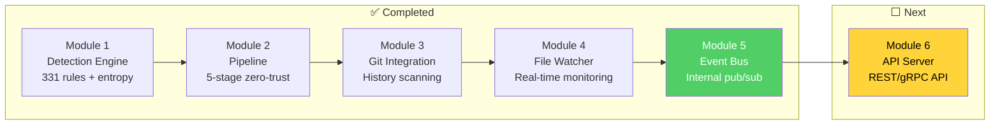

### How Module 6 Builds on Module 5

| Capability | Module 5 (Event Bus) | Module 6 (API Server) |
|-----------|---------------------|----------------------|
| **Communication** | In-process pub/sub | External HTTP/gRPC |
| **Consumers** | Internal components | External clients (CI/CD, dashboards) |
| **Real-time data** | Events flow through channels | Server-Sent Events stream to clients |
| **Think of it as** | Internal radio station | External broadcast antenna |

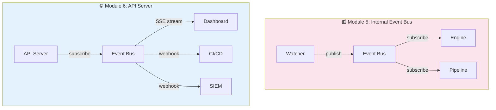

### Key Concepts You'll Learn in Module 6

1. **REST API Design** — Endpoints for scanning, results, and configuration
2. **Server-Sent Events** — Real-time streaming of scan results to clients
3. **Request/Response vs. Events** — When to use synchronous APIs vs. async events
4. **API Authentication** — Token-based access control for API endpoints

---

*CredVigil — Your watchful guard against leaked credentials.*

*Copyright 2026 CredVigil Contributors. Licensed under the Apache License, Version 2.0.*
